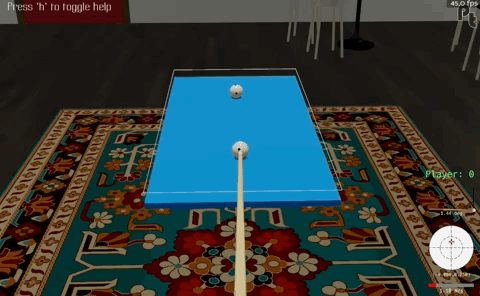
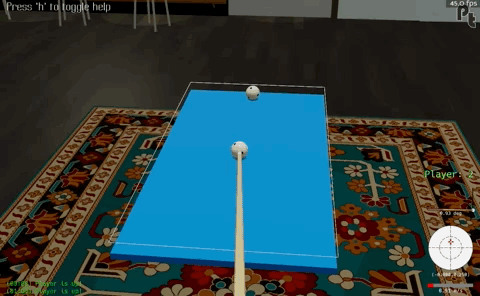
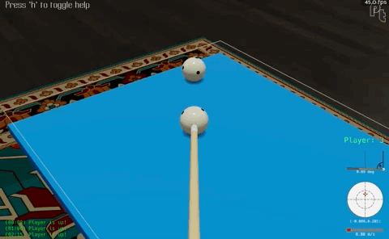

# Welcome

Welcome, and thanks for taking a look at my project. This is a small document to help you get started with LightZero + pooltool.

# Installation

## Step 1: Follow the install instructions in the README.md

Make sure you have a working version of LightZero by following the install instructions in `README.md`. This is an identical copy of the main LightZero repo.

## Step 2: Install `pooltool`

Next, install this pooltool version:

```bash
pip install pooltool-billiards==0.2.2.1
```

Verify your installation:

```bash
python -c "import pooltool; print(pooltool.__version__)"
```

It should read `0.2.2.1`.

Further test your installation by running the command line program:

```bash
# Unix
run_pooltool

# Windows
run_pooltool.bat
```

(For instructions on how to play, check out the [Wiki](https://github.com/ekiefl/pooltool/wiki/Controls))

# A simple game: Sum To Three

Standard billiards games like 8-ball, 9-ball, and snooker have complex rulesets which make learning more difficult.

To make things much simpler (to begin), I created a game called _sum to three_. The rules are simple.

1. The game is played on a table with no pockets
1. There are 2 balls: a cue ball and an object ball
1. The player must hit the object ball with the cue ball
1. The player scores a point if the number of times a ball hits a cushion is 3
1. The player takes 10 shots, and their final score is the number of points they achieve

For example, this is a successful shot because there are three ball-cushion collisions:


This is an unsuccessful shot because there are four ball-cushion collisions:



## Action space

pool/billiards has a complex and continuous action space. When the agent strikes the cue ball, the cue is described by 5 continuous parameters:

```
V0 : positive float
    What initial velocity does the cue strike the ball?
phi : float (degrees)
    The direction you strike the ball
theta : float (degrees)
    How elevated is the cue from the playing surface, in degrees?
a : float
    How much side english should be put on? -1 being rightmost side of ball, +1 being
    leftmost side of ball
b : float
    How much vertical english should be put on? -1 being bottom-most side of ball, +1 being
    topmost side of ball
```

Since sum to three is a simple game, I have created a reduced action space with 2 parameters:

1. V0: The speed of the cue stick. Increasing this means the cue ball travels further
1. cut angle: The angle that the cue ball hits the object ball with

For example, in this shot, the cut angle is -70 (hitting the left side of the object ball):



For example, in this shot, the cut angle is 0 (head-on collision):



Based on the game dimensions, a suitable bound for the action parameters are as follows:

```python
action=spaces.Box(
    low=np.array([0.3, -70], dtype=np.float32),
    high=np.array([3.0, +70], dtype=np.float32),
    shape=(2,),
    dtype=np.float32,
)
```

So, [0.3, 3.0] for speed and [-70, 70] for cut angle.

# Experiment 1: continuous observation space

My first experiment was to see whether an agent could learn to play the game from a continuous observation space defined by the two balls' coordinates. That means the observation space has four parameters:

1. Cue ball x coordinate
1. Cue ball y coordinate
1. Object ball x coordinate
1. Object ball y coordinate

The environment can be found in `./zoo/pooltool/sum_to_three/envs/sum_to_three_env.py` and the config can be found in `./zoo/pooltool/sum_to_three/config/sum_to_three_config.py`.

You can run the experiment like so:

```bash
python ./zoo/pooltool/sum_to_three/config/sum_to_three_config.py
```

## Results

The results end up in `./data_pooltool_ctree/`.

Here are the trajectories for the 3 experiments I ran longest:


Here are the same trajectories zoomed into the first 10k iterations:


Unfortunately, the agent doesn't converge to perfect play.

# Experiment 2: discrete (image) observation space

The continuous observation space will not work for real billiards games with multiple balls and obstacles. So as a second experiment, I created a discrete observation space with several feature planes.

I created 5 feature planes, each 100 x 50 pixels which are the relative dimensions of the table:

1. The cue ball
1. The object ball
1. Both balls
1. A line drawn between their line of centers
1. The cushions

Here is an example:


The code relevant that creates these feature planes can be found at `./zoo/pooltool/image_representation.py`. If you run this file, you can produce the above plot for several frames to see exactly how the above plot is produced.

The environment for this observation space can be found in `./zoo/pooltool/sum_to_three/envs/sum_to_three_image_env.py` and the config can be found in `./zoo/pooltool/sum_to_three/config/sum_to_three_image_config.py`.

You can run the experiment like so:

```bash
python ./zoo/pooltool/sum_to_three/config/sum_to_three_image_config.py
```

## Results

The results end up in `./data_pooltool_ctree/`.

Despite my best efforts, I am unable to observe any learning using this observation space. Here are the results of the longest experiment I attempted:


# Summary and Future Direction

Currently `zoo/pooltool` contains unit-tested modules for discrete (image-based) and continuous (coordinate-based) pool experiments for the "hello world" game I made called sum to three.

But there are problems:

1. The continuous environment learns something, but does not converge
1. The discrete environment doesn't learn anything

I think to proceed I need the help of experts to look at the config and environment for each experiment type.

If anyone is able to take a look, please follow the install instructions above. I purposefully created a fork that does not touch any of the upstream code. The only modifications I made were the addition of `zoo/pooltool`, so it is a faithful clone of the main repo.

I also think a future direction could be including pooltool as a supported environment for LightZero. It represents a continuous action space with scalable complexity (all the way from sum to three to advanced planning required for 8-ball and 9-ball pool). If anyone has suggestions for making this happen, I am very interested in collaborating.

Thanks for reading and looking forward to any discussions this sparks. To comment, visit the discussion page: https://github.com/opendilab/LightZero/discussions/182
