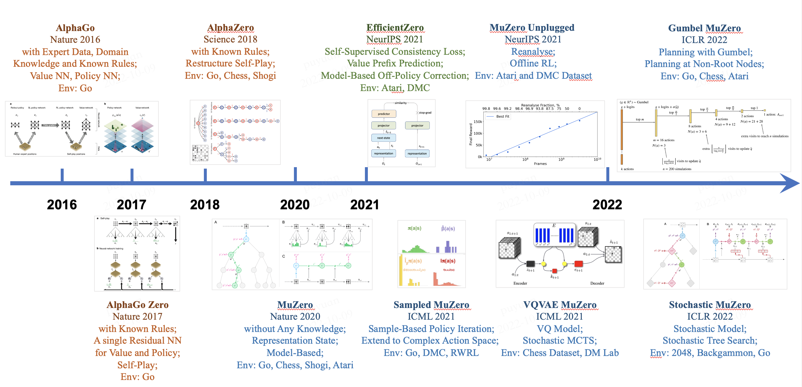
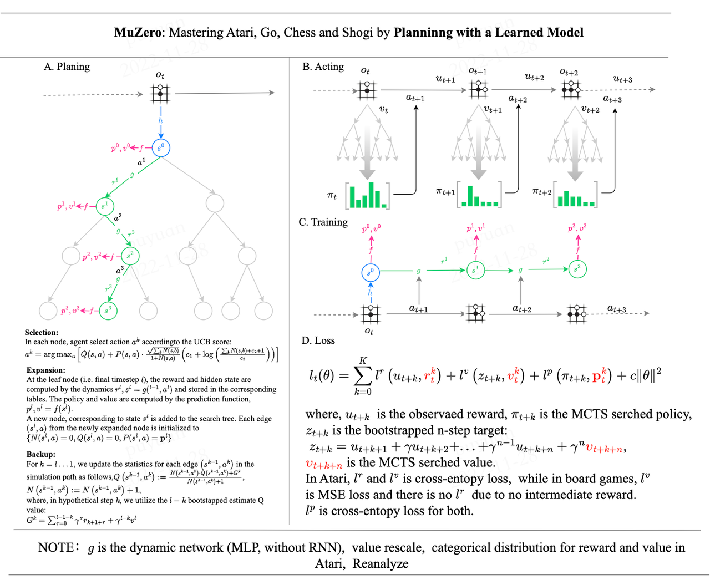
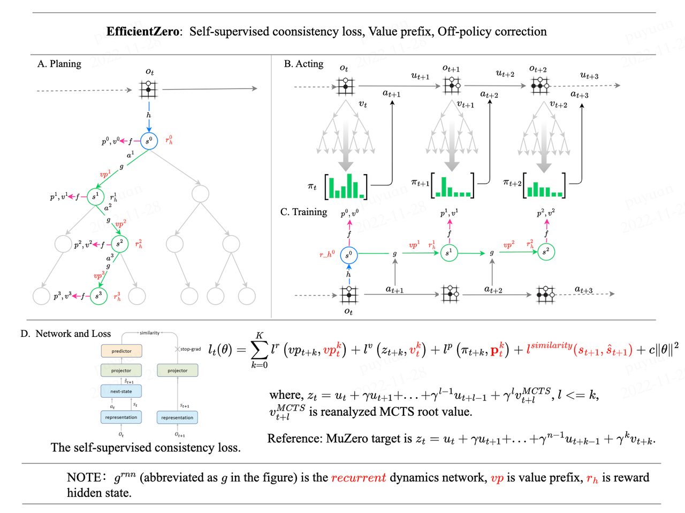
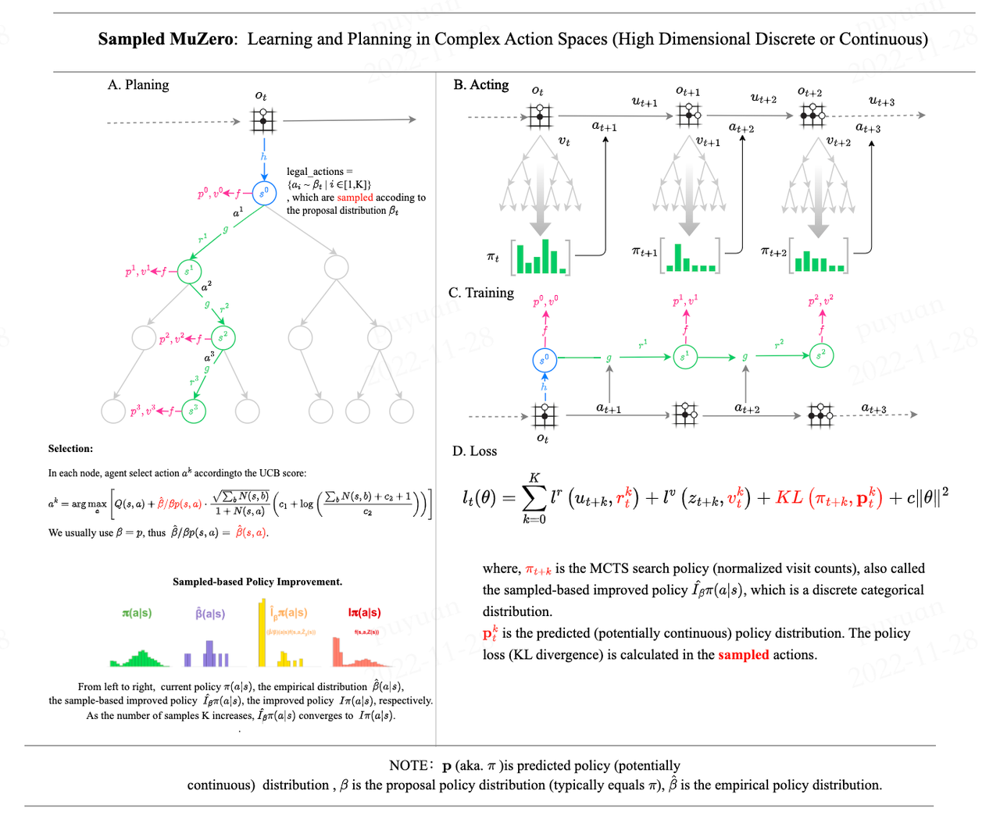
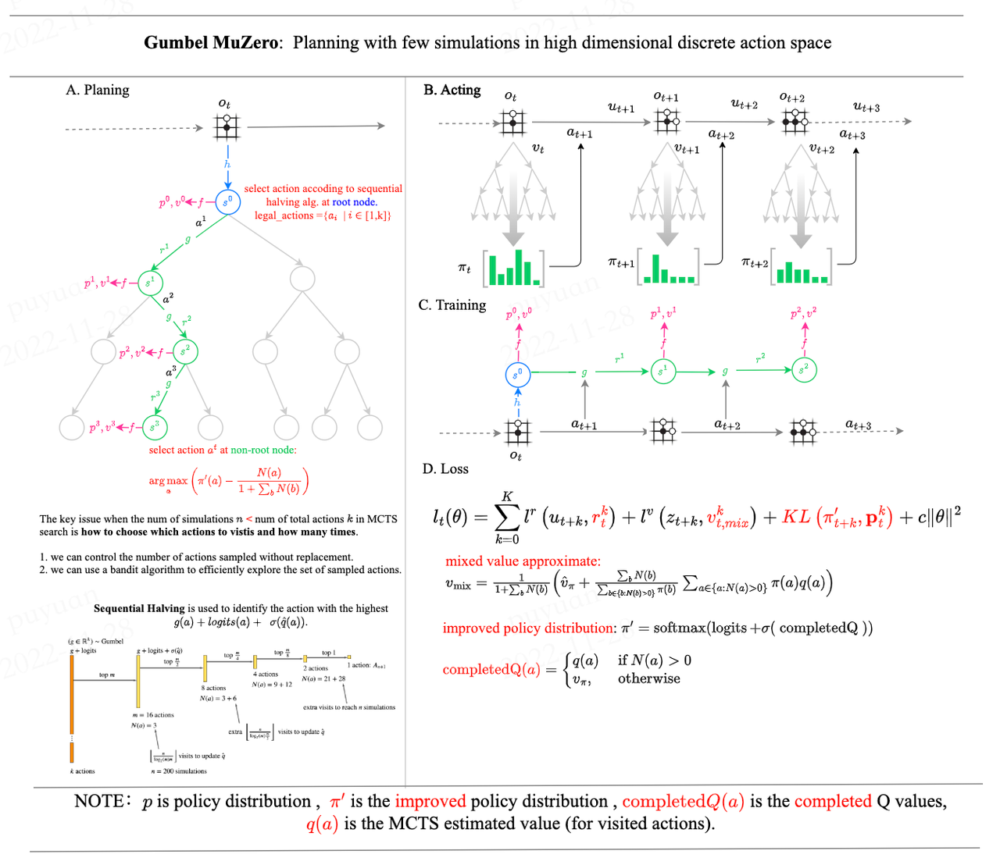

# LightZero
The following is an overview of the historical evolution of the MCTS algorithm series:


## Introduction to LightZero
LightZero is a library with a [PyTorch](https://pytorch.org/) implementation of Monte Carlo Tree Search (MCTS) algorithms, including:
- [AlphaZero](https://www.science.org/doi/10.1126/science.aar6404)
- [MuZero](https://arxiv.org/abs/1911.08265)
- [EfficientZero](https://arxiv.org/abs/2111.00210)
- [Sampled MuZero](https://arxiv.org/abs/2104.06303)
- [Gumbel MuZero](https://openreview.net/pdf?id=bERaNdoegnO)


[comment]: <> (- [AlphaGo Zero]&#40;https://www.nature.com/articles/nature24270&#41; )


Our implementation is mainly based on [DI-engine](https://github.com/opendilab/DI-engie).

The following are the overview MCTS principle diagrams of the above algorithms:

<details open>
<summary>(Click to Collapse)</summary>









</details>

## Installation

You can install latest LightZero in development from the Github source codes with the following command:

```bash
git clone https://github.com/opendilab/LightZero.git
cd LightZero
pip install .
```


[comment]: <> (The paper has been accepted by CoRL 2022 and we will release the code soon.)


[comment]: <> (## Citation)

[comment]: <> (If you find our repo, dataset or paper useful, please cite us as)

[comment]: <> (```bibtex)

[comment]: <> (@article{shao2022interfuser,)

[comment]: <> ( title={Safety-Enhanced Autonomous Driving Using Interpretable Sensor Fusion Transformer},)

[comment]: <> ( author={Hao Shao and Letian Wang and RuoBing Chen and Hongsheng Li and Yu Liu},)

[comment]: <> ( journal={arXiv preprint arXiv:2207.14024},)

[comment]: <> ( year={2022},)

[comment]: <> (})

[comment]: <> (```)

## Citation
```latex
@misc{lightzero,
    title={{LightZero: OpenDILab} A lightweight MCTS algorithm series library},
    author={LightZero Contributors},
    publisher = {GitHub},
    howpublished = {\url{https://github.com/opendilab/LightZero}},
    year={2022},
}
```

## License
All code within this repository is under [Apache License 2.0](https://www.apache.org/licenses/LICENSE-2.0).