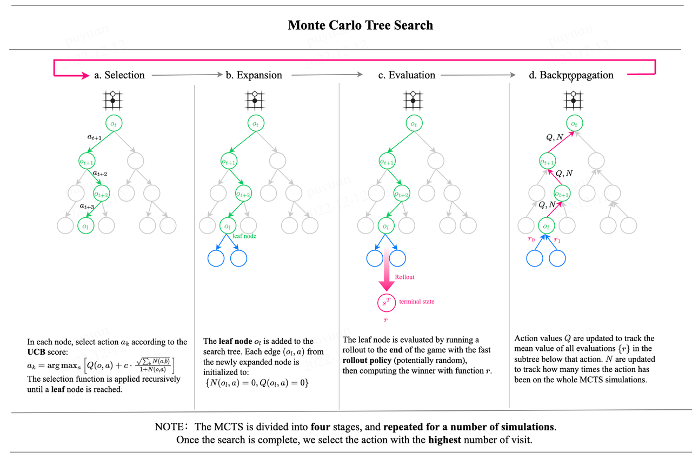
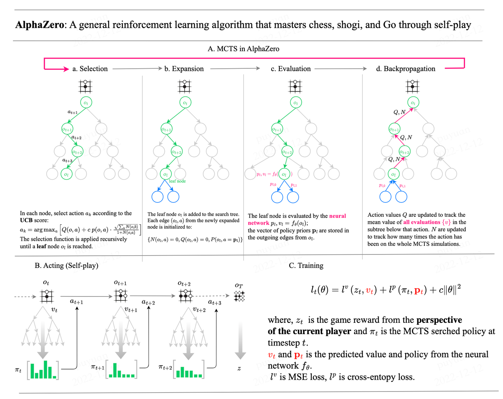
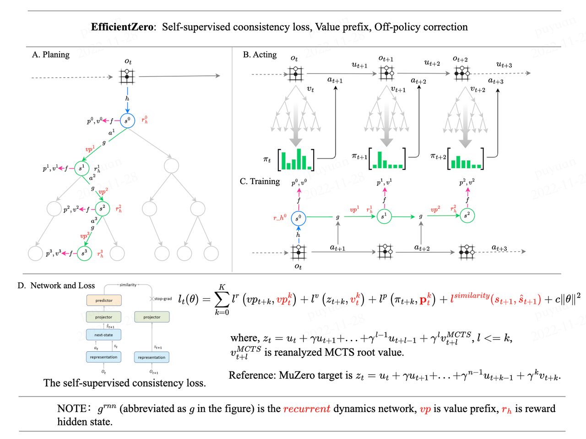
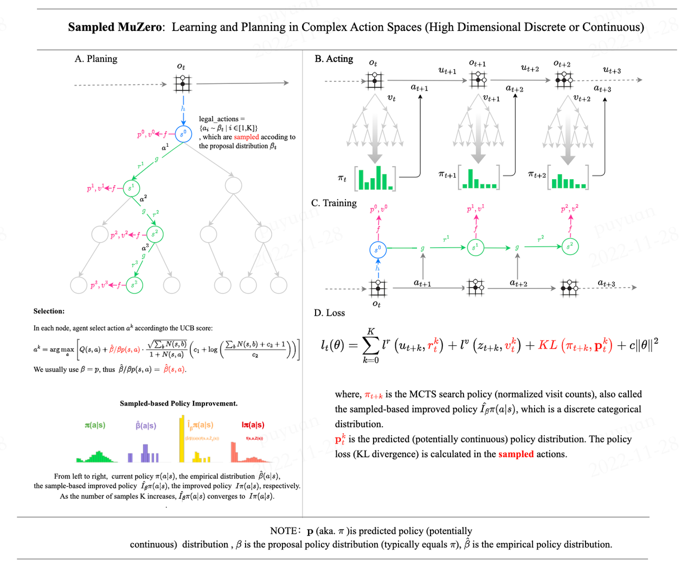

# LightZero

[](https://twitter.com/opendilab)
[](https://pypi.org/project/LightZero/)


[](https://github.com/opendilab/LightZero/actions?query=workflow%3A%22Docs+Deploy%22)
[](https://github.com/opendilab/LightZero/actions?query=workflow%3A%22Code+Test%22)
[](https://github.com/opendilab/LightZero/actions?query=workflow%3A%22Badge+Creation%22)
[](https://github.com/opendilab/LightZero/actions?query=workflow%3A%22Package+Release%22)
[](https://codecov.io/gh/opendilab/LightZero)


[](https://github.com/opendilab/LightZero/stargazers)
[](https://github.com/opendilab/LightZero/network)

[](https://github.com/opendilab/LightZero/issues)
[](https://github.com/opendilab/LightZero/pulls)
[](https://github.com/opendilab/LightZero/graphs/contributors)
[](https://github.com/opendilab/LightZero/blob/master/LICENSE)

> LightZero is a lightweight, efficient, and easy-to-understand open-source algorithm toolkits that combines Monte Carlo Tree Search (MCTS) and Reinforcement Learning (RL). 

## Background

The method of combining Monte Carlo Tree Search (MCTS) and Deep Reinforcemeent Learning (DRL) represented by AlphaZero and MuZero has achieved superhuman level in various games such as Go and Atari , has also made gratifying progress in scientific fields such as protein structure prediction, matrix multiplication algorithm search, etc. 
The following is an overview of the historical evolution of the Monte Carlo Tree Search (MCTS) algorithm series:


English | [简体中文](https://github.com/opendilab/LightZero/blob/main/README.zh.md)

## Overview

**LightZero** is an open-source algorithm tollkits that combines Monte Carlo Tree Search (MCTS) and Reinforcement Learning (RL). It provides support for a range of MCTS-based RL algorithms with following advantages:
- Lightweight.
- Efficient.
- Easy-to-understand.

For further details, please refer to [Features](#features), [Framework Structure](#framework-structure) and [Integrated Algorithms](#integrated-algorithms).

**LightZero** aims to **promote the standardization and acceleration of MCTS algorithm families**. A performance comparison of all implemented algorithms under a unified framework is presented in the [Benchmark](#benchmark).

### Outline

- [Overview](#overview)
  - [Outline](#outline)
  - [Features](#features)
  - [Framework Structure](#framework-structure)
  - [Integrated Algorithms](#integrated-algorithms)
- [Installation](#installation)
- [Quick Start](#quick-start)
- [Benchmark](#benchmark)
- [Awesome-MCTS Notes](#awesome-mcts-notes)
  - [Paper Notes](#paper-notes)
  - [Algo. Overview](#algo-overview)
- [Awesome-MCTS Papers](#awesome-mcts-papers)
  - [Key Papers](#key-ppers)
  - [Other Papers](#other-ppers)
- [Feedback and Contribution](#feedback-and-contribution)
- [Citation](#citation)
- [Acknowledgments](#acknowledgments)
- [License](#license)

### Features

**Lightweight**: LightZero integrates multiple MCTS algorithm families and can solve decision-making problems with various attributes in a lightweight framework. The algorithms and environments LightZero implemented can be found [here](#integrated-algorithms).

**Efficient**: LightZero uses mixed heterogeneous computing programming to improve computational efficiency for the most time-consuming part of MCTS algorithms.

**Easy-to-understand**: LightZero provides detailed documentation and algorithm framework diagrams for all integrated algorithms to help users understand the algorithm's core and compare the differences and similarities between algorithms under the same paradigm. LightZero also provides function call graphs and network structure diagrams for algorithm code implementation, making it easier for users to locate critical code. All the documentations can be found [here](#paper-notes).

### Framework Structure

<p align="center">
  
  
</p>

To understand the framework structure of LightZero, the following important components need to be understood:

**Model**:
``Model`` is used to define the network structure, including the ``__init__`` function for initializing the network structure and the ``forward`` function for computing the network's forward propagation.

**Policy**:
``Policy`` defines the way the network is updated and interacts with the environment, including three processes: the ``learning`` process, the ``collecting`` process, and the ``evaluation`` process.

**MCTS**:
``MCTS`` defines the structure of the Monte Carlo search tree and the way it interacts with the Policy. The implementation of MCTS includes two languages: Python and C++, implemented in ``ptree`` and ``ctree``, respectively.

### Integrated Algorithms
LightZero is a library with a [PyTorch](https://pytorch.org/) implementation of MCTS algorithms (sometimes combined with cython and cpp), including:
- [AlphaZero](https://www.science.org/doi/10.1126/science.aar6404)
- [MuZero](https://arxiv.org/abs/1911.08265)
- [EfficientZero](https://arxiv.org/abs/2111.00210)
- [Sampled MuZero](https://arxiv.org/abs/2104.06303)

[comment]: <> (- [Gumbel MuZero]&#40;https://openreview.net/pdf?id=bERaNdoegnO&#41;)

The environments and algorithms currently supported by LightZero are shown in the table below:

| Env./Alg.      | AlphaZero | MuZero | EfficientZero | Sampled EfficientZero |
| ------------- | --------- | ------ | ------------- | --------------------- |
| Atari         | ---       | ✔    | ✔           | ✔                   |
| tictactoe     | ✔       | ✔    | 🔒          | 🔒                  |
| chess         | 🔒       | 🔒   | 🔒          | 🔒                  |
| go            | 🔒       | 🔒   | 🔒          | 🔒                  |
| gomoku        | ✔       | ✔    | 🔒          | 🔒                  |
| lunarlander | ---       | ✔    | ✔           | ✔                   |
| bipedalwalker   | ---       | ✔    | ✔           | ✔                   |
| cartpole     | ---       | ✔    | ✔           | ✔                   |
| pendulum      | ---       | ✔    | ✔           | ✔                   |

## Installation

You can install latest LightZero in development from the GitHub source codes with the following command:

```bash
git clone https://github.com/opendilab/LightZero.git
cd LightZero
pip3 install -e .
```

[comment]: <> (- [AlphaGo Zero]&#40;https://www.nature.com/articles/nature24270&#41; )

## Quick Start

Train a MuZero agent to play [CartPole](https://gymnasium.farama.org/environments/classic_control/cart_pole/):

```bash
cd LightZero
python3 -u zoo/classic_control/cartpole/config/cartpole_muzero_config.py
```

Train a MuZero agent to play [Pong](https://gymnasium.farama.org/environments/atari/pong/):

```bash
cd LightZero
python3 -u zoo/atari/config/atari_muzero_config.py
```

Train a MuZero agent to play [TicTacToe](https://en.wikipedia.org/wiki/Tic-tac-toe):

```bash
cd LightZero
python3 -u zoo/board_games/tictactoe/config/tictactoe_muzero_bot-mode_config.py
```

## Benchmark

<details open><summary>Click to collapse</summary>

Below are the benchmark results of [MuZero](https://github.com/opendilab/LightZero/blob/main/lzero/policy/muzero.py), [MuZero w/ SSL](https://github.com/opendilab/LightZero/blob/main/lzero/policy/muzero.py) , [EfficientZero](https://github.com/opendilab/LightZero/blob/main/lzero/policy/efficientzero.py) and [Sampled EfficientZero](https://github.com/opendilab/LightZero/blob/main/lzero/policy/sampled_efficientzero.py) on three discrete action space games in [Atari](https://github.com/opendilab/LightZero/blob/main/zoo/atari/envs/atari_lightzero_env.py).

<p align="center">
  
  
  
  
</p>


Below are the benchmark results of [Sampled EfficientZero](https://github.com/opendilab/LightZero/blob/main/lzero/policy/sampled_efficientzero.py) with ``Factored/Gaussian`` policy representation on two continuous action space games: [Pendulum-v1](https://github.com/opendilab/LightZero/blob/main/zoo/classic_control/pendulum/envs/pendulum_lightzero_env.py), [LunarLanderContinuous-v2](https://github.com/opendilab/LightZero/blob/main/zoo/box2d/lunarlander/envs/lunarlander_env.py).

<p align="center">
  
  
  
</p>

Below are the benchmark results of [AlphaZero](https://github.com/opendilab/LightZero/blob/main/lzero/policy/alphazero.py) and [MuZero](https://github.com/opendilab/LightZero/blob/main/lzero/policy/muzero.py) on two board_games: [TicTacToe](https://github.com/opendilab/LightZero/blob/main/zoo/board_games/tictactoe/envs/tictactoe_env.py), [Gomoku](https://github.com/opendilab/LightZero/blob/main/zoo/board_games/gomoku/envs/gomoku_env.py).

<p align="center">
  
  
</p>

</details>


## Awesome-MCTS Notes

### Paper Notes
The following are the detailed paper notes (in Chinese) of the above algorithms:

<details open><summary>Click to collapse</summary>

[AlphaZero](https://github.com/opendilab/LightZero/blob/main/assets/paper_notes/AlphaZero.pdf)
[MuZero](https://github.com/opendilab/LightZero/blob/main/assets/paper_notes/MuZero.pdf)
[EfficientZero](https://github.com/opendilab/LightZero/blob/main/assets/paper_notes/EfficientZero.pdf)
[SampledMuZero](https://github.com/opendilab/LightZero/blob/main/assets/paper_notes/SampledMuZero.pdf)
[NotationTable](https://github.com/opendilab/LightZero/blob/main/assets/paper_notes/SymbolTable.pdf)

</details>

### Algo. Overview

The following are the overview MCTS principle diagrams of the above algorithms:

<details><summary>Click to expand</summary>











</details>

## Awesome-MCTS Papers

Here is a collection of research papers about **Monte Carlo Tree Search**.
[This Section](#awesome-msts-papers) will be continuously updated to track the frontier of MCTS. 

### Key Papers

<details><summary>Click to expand</summary>

#### LightZero Implemented series

- [2018 _Science_ AlphaZero: A general reinforcement learning algorithm that masters chess, shogi, and Go through self-play](https://www.science.org/doi/10.1126/science.aar6404)
- [2019 MuZero: Mastering Atari, Go, Chess and Shogi by Planning with a Learned Model](https://arxiv.org/abs/1911.08265)
- [2021 EfficientZero: Mastering Atari Games with Limited Data](https://arxiv.org/abs/2111.00210)
- [2021 Sampled MuZero: Learning and Planning in Complex Action Spaces](https://arxiv.org/abs/2104.06303)

[comment]: <> (- [2022 Gumbel MuZero: Policy Improoveemenet by Planning with Gumbel]&#40;https://openreview.net/pdf?id=bERaNdoegnO&#41;)

#### AlphaGo series

- [2015 _Nature_ AlphaGo Mastering the game of Go with deep neural networks and tree search](https://www.nature.com/articles/nature16961)
- [2017 _Nature_ AlphaGo Zero Mastering the game of Go without human knowledge](https://www.nature.com/articles/nature24270)
- [2019 ELF OpenGo: An Analysis and Open Reimplementation of AlphaZero](https://arxiv.org/abs/1902.04522) 
  - [Code](https://github.com/pytorch/ELF)
#### MuZero series
- [2022 Online and Offline Reinforcement Learning by Planning with a Learned Model](https://arxiv.org/abs/2104.06294)
- [2021 Vector Quantized Models for Planning](https://arxiv.org/abs/2106.04615)
- [2022 Stochastic MuZero: Plannig in Stochastic Environments with A Learned Model](https://openreview.net/pdf?id=X6D9bAHhBQ1)
- [2021 Muesli: Combining Improvements in Policy Optimization. ](https://arxiv.org/abs/2104.06159)
#### MCTS Analysis
- [2020 Monte-Carlo Tree Search as Regularized Policy Optimization](https://arxiv.org/abs/2007.12509)
- [2021 Self-Consistent Models and Values](https://arxiv.org/abs/2110.12840)
- [2022 Adversarial Policies Beat Professional-Level Go AIs](https://arxiv.org/abs/2211.00241)
- [2022 _PNAS_ Acquisition of Chess Knowledge in AlphaZero.](https://arxiv.org/abs/2111.09259)

#### MCTS Application
- [2022 _Nature_ Discovering faster matrix multiplication algorithms with reinforcement learning](https://www.nature.com/articles/s41586-022-05172-4) 
  - [Code](https://github.com/deepmind/alphatensor)
- [2022 MuZero with Self-competition for Rate Control in VP9 Video Compression](https://arxiv.org/abs/2202.06626)
- [2021 DouZero: Mastering DouDizhu with Self-Play Deep Reinforcement Learning](https://arxiv.org/abs/2106.06135)
- [2019 Combining Planning and Deep Reinforcement Learning in Tactical Decision Making for Autonomous Driving](https://arxiv.org/pdf/1905.02680.pdf)

</details>

### Other Papers

<details><summary>Click to expand</summary>

#### ICML
- [Efficient Learning for AlphaZero via Path Consistency](https://proceedings.mlr.press/v162/zhao22h/zhao22h.pdf) 2022
  - Dengwei Zhao, Shikui Tu, Lei Xu
  - Key: limited amount of self-plays,  path consistency (PC) optimality
  - ExpEnv: Go, Othello, Gomoku
- [Convex Regularization in Monte-Carlo Tree Search](https://arxiv.org/pdf/2007.00391.pdf) 2021
  - Tuan Dam, Carlo D'Eramo, Jan Peters, Joni Pajarinen
  - Key: entropy-regularization backup operators, regret analysis, Tsallis etropy, 
  - ExpEnv: synthetic tree, Atari
- [Information Particle Filter Tree: An Online Algorithm for POMDPs with Belief-Based Rewards on Continuous Domains](http://proceedings.mlr.press/v119/fischer20a/fischer20a.pdf) 2020
  - Johannes Fischer, Ömer Sahin Tas
  - Key: Continuous POMDP, Particle Filter Tree, information-based reward shaping, Information Gathering.
  - ExpEnv: POMDPs.jl framework
  - [Code](https://github.com/johannes-fischer/icml2020_ipft)
- [Retro*: Learning Retrosynthetic Planning with Neural Guided A* Search](http://proceedings.mlr.press/v119/chen20k/chen20k.pdf) 2020
  - Binghong Chen, Chengtao Li, Hanjun Dai, Le Song 
  - Key: chemical retrosynthetic planning, neural-based A*-like algorithm, ANDOR tree
  - ExpEnv: USPTO datasets
  - [Code](https://github.com/binghong-ml/retro_star)
#### ICLR
- [Enabling Arbitrary Translation Objectives with Adaptive Tree Search](https://arxiv.org/pdf/2202.11444.pdf) 2022
  - Wang Ling, Wojciech Stokowiec, Domenic Donato, Chris Dyer, Lei Yu, Laurent Sartran, Austin Matthews
  - Key: adaptive tree search, translation models, autoregressive models, 
  - ExpEnv: Chinese–English and Pashto–English tasks from WMT2020, German–English from WMT2014
- [What's Wrong with Deep Learning in Tree Search for Combinatorial Optimization](https://arxiv.org/abs/2201.10494) 2022
  - Maximili1an Böther, Otto Kißig, Martin Taraz, Sarel Cohen, Karen Seidel, Tobias Friedrich
  - Key: Combinatorial optimization, open-source benchmark suite for the NP-hard MAXIMUM INDEPENDENT SET problem, an in-depth analysis of the popular guided tree search algorithm,  compare the tree search implementations to other solvers
  - ExpEnv: NP-hard MAXIMUM INDEPENDENT SET.
  - [Code](https://github.com/maxiboether/mis-benchmark-framework)
- [Monte-Carlo Planning and Learning with Language Action Value Estimates](https://openreview.net/pdf?id=7_G8JySGecm) 2021
  - Youngsoo Jang, Seokin Seo, Jongmin Lee, Kee-Eung Kim
  - Key: Monte-Carlo tree search with language-driven exploration, locally optimistic language value estimates,
  - ExpEnv: Interactive Fiction (IF) games
- [Practical Massively Parallel Monte-Carlo Tree Search Applied to Molecular Design](https://arxiv.org/abs/2006.10504) 2021
  - Xiufeng Yang, Tanuj Kr Aasawat, Kazuki Yoshizoe
  - Key: massively parallel Monte-Carlo Tree Search, molecular design, Hash-driven parallel search, 
  - ExpEnv:  octanol-water partition coefficient (logP) penalized by the synthetic accessibility (SA) and large Ring Penalty score.
- [Watch the Unobserved: A Simple Approach to Parallelizing Monte Carlo Tree Search](https://arxiv.org/pdf/1810.11755.pdf) 2020
  - Anji Liu, Jianshu Chen, Mingze Yu, Yu Zhai, Xuewen Zhou, Ji Liu
  - Key: parallel Monte-Carlo Tree Search, partition the tree into sub-trees efficiently, compare the observation ratio of each processor
  - ExpEnv: speedup and performance comparison on JOY-CITY game, average episode return on atari game
  - [Code](https://github.com/liuanji/WU-UCT)
- [Learning to Plan in High Dimensions via Neural Exploration-Exploitation Trees](https://openreview.net/pdf?id=rJgJDAVKvB) 2020
  - Binghong Chen,  Bo Dai, Qinjie Lin, Guo Ye, Han Liu, Le Song
  - Key: meta path planning algorithm, exploits a novel neural architecture which can learn promising search directions from problem structures.
  - ExpEnv: a 2d workspace with a 2 DoF (degrees of freedom) point robot, a 3 DoF stick robot and a 5 DoF snake robot
#### NeurIPS
- [Evaluation Beyond Task Performance: Analyzing Concepts in AlphaZero in Hex](https://openreview.net/pdf?id=dwKwB2Cd-Km) 2022 
  - Charles Lovering, Jessica Zosa Forde, George Konidaris, Ellie Pavlick, Michael L. Littman
  - Key: AlphaZero’s internal representations, model probing and behavioral tests, how these concepts are captured in the network.
  - ExpEnv: Hex
- [Are AlphaZero-like Agents Robust to Adversarial Perturbations?](https://openreview.net/pdf?id=yZ_JlZaOCzv) 2022
  - Li-Cheng Lan, Huan Zhang, Ti-Rong Wu, Meng-Yu Tsai, I-Chen Wu, 4 Cho-Jui Hsieh
  - Key:  adversarial states, first adversarial attack on Go AIs
  - ExpEnv: Go
- [Monte Carlo Tree Descent for Black-Box Optimization](https://openreview.net/pdf?id=FzdmrTUyZ4g) 2022
  - Yaoguang Zhai, Sicun Gao
  - Key: Black-Box Optimization, how to further integrate samplebased descent for faster optimization. 
  - ExpEnv: synthetic functions for nonlinear optimization, reinforcement learning problems in MuJoCo locomotion environments, and optimization problems in Neural Architecture Search (NAS).
- [Monte Carlo Tree Search based Variable Selection for High Dimensional Bayesian Optimization](https://openreview.net/pdf?id=SUzPos_pUC) 2022
  - Lei Song∗ , Ke Xue∗ , Xiaobin Huang, Chao Qian
  - Key:  a low-dimensional subspace via MCTS, optimizes in the subspace with any Bayesian optimization algorithm.
  - ExpEnv: NAS-bench problems and MuJoCo locomotion
- [Monte Carlo Tree Search With Iteratively Refining State Abstractions](https://proceedings.neurips.cc/paper/2021/file/9b0ead00a217ea2c12e06a72eec4923f-Paper.pdf) 2021
  - Samuel Sokota, Caleb Ho, Zaheen Ahmad, J. Zico Kolter
  - Key: stochastic environments, Progressive widening, abstraction refining,
  - ExpEnv:  Blackjack, Trap, five by five Go.
- [Deep Synoptic Monte Carlo Planning in Reconnaissance Blind Chess](https://proceedings.neurips.cc/paper/2021/file/215a71a12769b056c3c32e7299f1c5ed-Paper.pdf) 2021
  - Gregory Clark
  - Key: imperfect information, belief state with an unweighted particle filter, a novel stochastic abstraction of information states.
  - ExpEnv:  reconnaissance blind chess
- [POLY-HOOT: Monte-Carlo Planning in Continuous Space MDPs with Non-Asymptotic Analysis](https://proceedings.neurips.cc/paper/2020/file/30de24287a6d8f07b37c716ad51623a7-Paper.pdf) 2020
  - Weichao Mao, Kaiqing Zhang, Qiaomin Xie, Tamer Ba¸sar
  - Key: continuous state-action spaces, Hierarchical Optimistic Optimization,
  - ExpEnv: CartPole, Inverted Pendulum, Swing-up, and LunarLander.
- [Learning Search Space Partition for Black-box Optimization using Monte Carlo Tree Search](https://proceedings.neurips.cc/paper/2020/file/e2ce14e81dba66dbff9cbc35ecfdb704-Paper.pdf) 2020
  - Linnan Wang, Rodrigo Fonseca, Yuandong Tian
  - Key: learns the partition of the search space using a few samples, a nonlinear decision boundary and learns a local model to pick good candidates.
  - ExpEnv: MuJoCo locomotion tasks, Small-scale Benchmarks, 
- [Mix and Match: An Optimistic Tree-Search Approach for Learning Models from Mixture Distributions](https://arxiv.org/abs/1907.10154) 2020
  - Matthew Faw, Rajat Sen, Karthikeyan Shanmugam, Constantine Caramanis, Sanjay Shakkottai
  - Key: covariate shift problem, Mix&Match combines stochastic gradient descent (SGD) with optimistic tree search and model re-use (evolving partially trained models with samples from different mixture distributions)
  - [Code](https://github.com/matthewfaw/mixnmatch)

#### Other Conference or Journal
- [On Monte Carlo Tree Search and Reinforcement Learning](https://www.jair.org/index.php/jair/article/download/11099/26289/20632) Journal of Artificial Intelligence Research 2017.
- [Sample-Efficient Neural Architecture Search by Learning Actions for Monte Carlo Tree Search](https://arxiv.org/pdf/1906.06832) IEEE Transactions on Pattern Analysis and Machine Intelligence 2022.
</details>


[comment]: <> (The paper has been accepted by CoRL 2022 and we will release the code soon.)


[comment]: <> (## Citation)

[comment]: <> (If you find our repo, dataset or paper useful, please cite us as)

[comment]: <> (```bibtex)

[comment]: <> (@article{shao2022interfuser,)

[comment]: <> ( title={Safety-Enhanced Autonomous Driving Using Interpretable Sensor Fusion Transformer},)

[comment]: <> ( author={Hao Shao and Letian Wang and RuoBing Chen and Hongsheng Li and Yu Liu},)

[comment]: <> ( journal={arXiv preprint arXiv:2207.14024},)

[comment]: <> ( year={2022},)

[comment]: <> (})

[comment]: <> (```)

## Feedback and Contribution
- [File an issue](https://github.com/opendilab/LightZero/issues/new/choose) on Github
- Contact our email (opendilab@pjlab.org.cn)

- We appreciate all the feedbacks and contributions to improve LightZero, both algorithms and system designs. 

[comment]: <> (- Contributes to our future plan [Roadmap]&#40;https://github.com/opendilab/LightZero/projects&#41;)

[comment]: <> (And `CONTRIBUTING.md` offers some necessary information.)


## Citation
```latex
@misc{lightzero,
    title={{LightZero: OpenDILab} A lightweight and efficient MCTS/AlphaZero/MuZero algorithm toolkits.},
    author={LightZero Contributors},
    publisher = {GitHub},
    howpublished = {\url{https://github.com/opendilab/LightZero}},
    year={2023},
}
```

## Acknowledgments

This repo is partially based on the following repo, many thanks to their pioneering work:

- https://github.com/opendilab/DI-engine
- https://github.com/YeWR/EfficientZero
- https://github.com/werner-duvaud/muzero-general

A special thanks to [@PaParaZz1](https://github.com/PaParaZz1), [@karroyan](https://github.com/karroyan), [@nighood](https://github.com/nighood), 
[@jayyoung0802](https://github.com/jayyoung0802), [@timothijoe](https://github.com/timothijoe), [@TuTuHuss](https://github.com/TuTuHuss), [@puyuan1996](https://github.com/puyuan1996), [@HansBug](https://github.com/HansBug) for their contributions and support.


## License
All code within this repository is under [Apache License 2.0](https://www.apache.org/licenses/LICENSE-2.0).