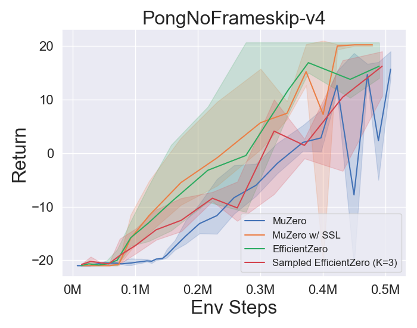

<div id="top"></div>

# LightZero

<div align="center">
    </a>
</div>

---

[](https://twitter.com/opendilab)
[](https://pypi.org/project/LightZero/)


[](https://github.com/opendilab/LightZero/actions?query=workflow%3A%22Code+Test%22)
[](https://github.com/opendilab/LightZero/actions?query=workflow%3A%22Badge+Creation%22)
[](https://github.com/opendilab/LightZero/actions?query=workflow%3A%22Package+Release%22)


[](https://github.com/opendilab/LightZero/stargazers)
[](https://github.com/opendilab/LightZero/network)

[](https://github.com/opendilab/LightZero/issues)
[](https://github.com/opendilab/LightZero/pulls)
[](https://github.com/opendilab/LightZero/graphs/contributors)
[](https://github.com/opendilab/LightZero/blob/master/LICENSE)

Updated on 2024.02.08 LightZero-v0.0.4

> LightZero is a lightweight, efficient, and easy-to-understand open-source algorithm toolkit that combines Monte Carlo Tree Search (MCTS) and Deep Reinforcement Learning (RL). 

English | [简体中文(Simplified Chinese)](https://github.com/opendilab/LightZero/blob/main/README.zh.md) | [Paper](https://arxiv.org/pdf/2310.08348.pdf)

## Background

The integration of Monte Carlo Tree Search and Deep Reinforcement Learning,
exemplified by AlphaZero and MuZero,
has achieved unprecedented performance levels in various games, including Go and Atari.
This advanced methodology has also made significant strides in scientific domains like protein structure prediction and the search for matrix multiplication algorithms.
The following is an overview of the historical evolution of the Monte Carlo Tree Search algorithm series:


## Overview

**LightZero** is an open-source algorithm toolkit that combines MCTS and RL for PyTorch. It provides support for a range of MCTS-based RL algorithms and applications with the following advantages:
- Lightweight.
- Efficient.
- Easy-to-understand.

For further details, please refer to [Features](#features), [Framework Structure](#framework-structure) and [Integrated Algorithms](#integrated-algorithms).

**LightZero** aims to **promote the standardization of the MCTS+RL algorithm family to accelerate related research and applications**. A performance comparison of all implemented algorithms under a unified framework is presented in the [Benchmark](#benchmark).

### Outline

- [Overview](#overview)
  - [Outline](#outline)
  - [Features](#features)
  - [Framework Structure](#framework-structure)
  - [Integrated Algorithms](#integrated-algorithms)
- [Installation](#installation)
- [Quick Start](#quick-start)
- [Benchmark](#benchmark)
- [Awesome-MCTS Notes](#awesome-mcts-notes)
  - [Paper Notes](#paper-notes)
  - [Algo. Overview](#algo-overview)
- [Awesome-MCTS Papers](#awesome-mcts-papers)
  - [Key Papers](#key-papers)
  - [Other Papers](#other-papers)
- [Feedback and Contribution](#feedback-and-contribution)
- [Citation](#citation)
- [Acknowledgments](#acknowledgments)
- [License](#license)

### Features

**Lightweight**: LightZero integrates multiple MCTS algorithm families and can solve decision-making problems with various attributes in a lightweight framework. The algorithms and environments LightZero implemented can be found [here](#integrated-algorithms).

**Efficient**: LightZero uses mixed heterogeneous computing programming to improve computational efficiency for the most time-consuming part of MCTS algorithms.

**Easy-to-understand**: LightZero provides detailed documentation and algorithm framework diagrams for all integrated algorithms to help users understand the algorithm's core and compare the differences and similarities between algorithms under the same paradigm. LightZero also provides function call graphs and network structure diagrams for algorithm code implementation, making it easier for users to locate critical code. All the documentation can be found [here](#paper-notes).

### Framework Structure

[comment]: <> (<p align="center">)

[comment]: <> (  )

[comment]: <> (  )

[comment]: <> (</p>)

<p align="center">
  
</p>

The above picture is the framework pipeline of LightZero. We briefly introduce the three core modules below: 

**Model**:
``Model`` is used to define the network structure, including the ``__init__`` function for initializing the network structure and the ``forward`` function for computing the network's forward propagation.

**Policy**:
``Policy`` defines the way the network is updated and interacts with the environment, including three processes: the ``learning`` process, the ``collecting`` process, and the ``evaluation`` process.

**MCTS**:
``MCTS`` defines the structure of the Monte Carlo search tree and the way it interacts with the Policy. The implementation of MCTS includes two languages: Python and C++, implemented in ``ptree`` and ``ctree``, respectively.

For the file structure of LightZero, please refer to [lightzero_file_structure](https://github.com/opendilab/LightZero/blob/main/assets/lightzero_file_structure.svg).

### Integrated Algorithms
LightZero is a library with a [PyTorch](https://pytorch.org/) implementation of MCTS algorithms (sometimes combined with cython and cpp), including:
- [AlphaZero](https://www.science.org/doi/10.1126/science.aar6404)
- [MuZero](https://arxiv.org/abs/1911.08265)
- [Sampled MuZero](https://arxiv.org/abs/2104.06303)
- [Stochastic MuZero](https://openreview.net/pdf?id=X6D9bAHhBQ1)
- [EfficientZero](https://arxiv.org/abs/2111.00210)
- [Gumbel MuZero](https://openreview.net/pdf?id=bERaNdoegnO&)

The environments and algorithms currently supported by LightZero are shown in the table below:

| Env./Algo.    | AlphaZero | MuZero | EfficientZero | Sampled EfficientZero | Gumbel MuZero | Stochastic MuZero | 
|---------------| --------- | ------ |-------------| ------------------ | ---------- |----------------|
| TicTacToe     | ✔       | ✔      | 🔒           | 🔒                | ✔          | 🔒             |
| Gomoku        | ✔       | ✔      | 🔒          | 🔒               | ✔          | 🔒             |
| Connect4      | ✔       | ✔      | 🔒          | 🔒               | 🔒           | 🔒             |
| 2048          | ✔       | ✔      | 🔒            | 🔒                | 🔒           | ✔              |
| Chess         | 🔒       | 🔒     | 🔒          | 🔒               | 🔒         | 🔒             |
| Go            | 🔒       | 🔒     | 🔒          | 🔒               | 🔒         | 🔒             |
| CartPole      | ---       | ✔      | ✔           | ✔                | ✔          | ✔              |
| Pendulum      | ---       | ✔      | ✔           | ✔                | ✔          | ✔              |
| LunarLander   | ---       | ✔      | ✔           | ✔                | ✔          | ✔              |
| BipedalWalker | ---       | ✔      | ✔           | ✔                | ✔          | 🔒              |
| Atari         | ---       | ✔      | ✔           | ✔                | ✔          | ✔              |
| MuJoCo        | ---       | ✔     | ✔          | ✔                | 🔒         | 🔒               |
| MiniGrid      | ---       | ✔     | ✔          | ✔               | 🔒         | 🔒             |
| Bsuite        | ---       | ✔     | ✔          | ✔               | 🔒         | 🔒             |

<sup>(1): "✔" means that the corresponding item is finished and well-tested.</sup>

<sup>(2): "🔒" means that the corresponding item is in the waiting-list (Work In Progress).</sup>

<sup>(3): "---" means that this algorithm doesn't support this environment.</sup>


## Installation

You can install the latest LightZero in development from the GitHub source codes with the following command:

```bash
git clone https://github.com/opendilab/LightZero.git
cd LightZero
pip3 install -e .
```

Kindly note that LightZero currently supports compilation only on `Linux` and `macOS` platforms.
We are actively working towards extending this support to the `Windows` platform. 
Your patience during this transition is greatly appreciated.

## Installation with Docker

We also provide a Dockerfile that sets up an environment with all dependencies needed to run the LightZero library. This Docker image is based on Ubuntu 20.04 and installs Python 3.8, along with other necessary tools and libraries.
Here's how to use our Dockerfile to build a Docker image, run a container from this image, and execute LightZero code inside the container.
1. **Download the Dockerfile**: The Dockerfile is located in the root directory of the LightZero repository. Download this [file](https://github.com/opendilab/LightZero/blob/main/Dockerfile) to your local machine.
2. **Prepare the build context**: Create a new empty directory on your local machine, move the Dockerfile into this directory, and navigate into this directory. This step helps to avoid sending unnecessary files to the Docker daemon during the build process.
    ```bash
    mkdir lightzero-docker
    mv Dockerfile lightzero-docker/
    cd lightzero-docker/
    ```
3. **Build the Docker image**: Use the following command to build the Docker image. This command should be run from inside the directory that contains the Dockerfile.
    ```bash
    docker build -t ubuntu-py38-lz:latest -f ./Dockerfile .
    ```
4. **Run a container from the image**: Use the following command to start a container from the image in interactive mode with a Bash shell.
    ```bash
    docker run -dit --rm ubuntu-py38-lz:latest /bin/bash
    ```
5. **Execute LightZero code inside the container**: Once you're inside the container, you can run the example Python script with the following command:
    ```bash
    python ./LightZero/zoo/classic_control/cartpole/config/cartpole_muzero_config.py
    ```

[comment]: <> (- [AlphaGo Zero]&#40;https://www.nature.com/articles/nature24270&#41; )

## Quick Start

Train a MuZero agent to play [CartPole](https://gymnasium.farama.org/environments/classic_control/cart_pole/):

```bash
cd LightZero
python3 -u zoo/classic_control/cartpole/config/cartpole_muzero_config.py
```

Train a MuZero agent to play [Pong](https://gymnasium.farama.org/environments/atari/pong/):

```bash
cd LightZero
python3 -u zoo/atari/config/atari_muzero_config.py
```

Train a MuZero agent to play [TicTacToe](https://en.wikipedia.org/wiki/Tic-tac-toe):

```bash
cd LightZero
python3 -u zoo/board_games/tictactoe/config/tictactoe_muzero_bot_mode_config.py
```

## Benchmark

<details open><summary>Click to collapse</summary>

- Below are the benchmark results of [AlphaZero](https://github.com/opendilab/LightZero/blob/main/lzero/policy/alphazero.py) and [MuZero](https://github.com/opendilab/LightZero/blob/main/lzero/policy/muzero.py) on three board games: [TicTacToe](https://github.com/opendilab/LightZero/blob/main/zoo/board_games/tictactoe/envs/tictactoe_env.py), [Connect4](https://github.com/opendilab/LightZero/blob/main/zoo/board_games/connect4/envs/connect4_env.py), [Gomoku](https://github.com/opendilab/LightZero/blob/main/zoo/board_games/gomoku/envs/gomoku_env.py).
<p align="center">
  
  
  
</p>

- Below are the benchmark results of [MuZero](https://github.com/opendilab/LightZero/blob/main/lzero/policy/muzero.py), [MuZero w/ SSL](https://github.com/opendilab/LightZero/blob/main/lzero/policy/muzero.py) , [EfficientZero](https://github.com/opendilab/LightZero/blob/main/lzero/policy/efficientzero.py) and [Sampled EfficientZero](https://github.com/opendilab/LightZero/blob/main/lzero/policy/sampled_efficientzero.py) on three discrete action space games in [Atari](https://github.com/opendilab/LightZero/blob/main/zoo/atari/envs/atari_lightzero_env.py).
<p align="center">
  
  
  
  
</p>


- Below are the benchmark results of [Sampled EfficientZero](https://github.com/opendilab/LightZero/blob/main/lzero/policy/sampled_efficientzero.py) with ``Factored/Gaussian`` policy representation on three classic continuous action space games: [Pendulum-v1](https://github.com/opendilab/LightZero/blob/main/zoo/classic_control/pendulum/envs/pendulum_lightzero_env.py), [LunarLanderContinuous-v2](https://github.com/opendilab/LightZero/blob/main/zoo/box2d/lunarlander/envs/lunarlander_env.py), [BipedalWalker-v3](https://github.com/opendilab/LightZero/blob/main/zoo/box2d/bipedalwalker/envs/bipedalwalker_env.py)
and two MuJoCo continuous action space games: [Hopper-v3](https://github.com/opendilab/LightZero/blob/main/zoo/mujoco/envs/mujoco_lightzero_env.py), [Walker2d-v3](https://github.com/opendilab/LightZero/blob/main/zoo/mujoco/envs/mujoco_lightzero_env.py).
> "Factored Policy" indicates that the agent learns a policy network that outputs a categorical distribution. After manual discretization, the dimensions of the action space for the five environments are 11, 49 (7^2), 256 (4^4), 64 (4^3), and 4096 (4^6), respectively. On the other hand, "Gaussian Policy" refers to the agent learning a policy network that directly outputs parameters (mu and sigma) for a Gaussian distribution.
<p align="center">
  
  
  
</p>
<p align="center">
  
  
  
</p>

- Below are the benchmark results of [GumbelMuZero](https://github.com/opendilab/LightZero/blob/main/lzero/policy/gumbel_muzero.py) and [MuZero](https://github.com/opendilab/LightZero/blob/main/lzero/policy/muzero.py) (under different simulation cost) on four environments: [PongNoFrameskip-v4](https://github.com/opendilab/LightZero/blob/main/zoo/atari/envs/atari_lightzero_env.py), [MsPacmanNoFrameskip-v4]((https://github.com/opendilab/LightZero/blob/main/zoo/atari/envs/atari_lightzero_env.py)), [Gomoku](https://github.com/opendilab/LightZero/blob/main/zoo/board_games/gomoku/envs/gomoku_env.py), and [LunarLanderContinuous-v2](https://github.com/opendilab/LightZero/blob/main/zoo/box2d/lunarlander/envs/lunarlander_env.py).
<p align="center">
  
  
  
  
</p>

- Below are the benchmark results of [StochasticMuZero](https://github.com/opendilab/LightZero/blob/main/lzero/policy/stochastic_muzero.py) and [MuZero](https://github.com/opendilab/LightZero/blob/main/lzero/policy/muzero.py) on [2048 environment](https://github.com/opendilab/LightZero/blob/main/zoo/game_2048/envs/game_2048_env.py) with varying levels of chance (num_chances=2 and 5).
<p align="center">
  
  
</p>

- Below are the benchmark results of various MCTS exploration mechanisms of [MuZero w/ SSL](https://github.com/opendilab/LightZero/blob/main/lzero/policy/muzero.py) in the [MiniGrid environment](https://github.com/opendilab/LightZero/blob/main/zoo/minigrid/envs/minigrid_lightzero_env.py).
<p align="center">
  
  
</p>

</details>


## Awesome-MCTS Notes

### Paper Notes
The following are the detailed paper notes (in Chinese) of the above algorithms:

<details open><summary>Click to collapse</summary>

  
- [AlphaZero](https://github.com/opendilab/LightZero/blob/main/assets/paper_notes/AlphaZero.pdf)
- [MuZero](https://github.com/opendilab/LightZero/blob/main/assets/paper_notes/MuZero.pdf)
- [EfficientZero](https://github.com/opendilab/LightZero/blob/main/assets/paper_notes/EfficientZero.pdf)
- [SampledMuZero](https://github.com/opendilab/LightZero/blob/main/assets/paper_notes/SampledMuZero.pdf)
- [GumbelMuZero](https://github.com/opendilab/LightZero/blob/main/assets/paper_notes/GumbelMuZero.pdf)
- [StochasticMuZero](https://github.com/opendilab/LightZero/blob/main/assets/paper_notes/StochasticMuZero.pdf)
- [NotationTable](https://github.com/opendilab/LightZero/blob/main/assets/paper_notes/SymbolTable.pdf)

</details>

### Algo. Overview

The following are the overview MCTS principle diagrams of the above algorithms:

<details><summary>Click to expand</summary>

- [MCTS](https://github.com/opendilab/LightZero/blob/main/assets/algo_overview/mcts_overview.pdf)
- [AlphaZero](https://github.com/opendilab/LightZero/blob/main/assets/algo_overview/alphazero_overview.pdf)
- [MuZero](https://github.com/opendilab/LightZero/blob/main/assets/algo_overview/muzero_overview.pdf)
- [EfficientZero](https://github.com/opendilab/LightZero/blob/main/assets/algo_overview/efficientzero_overview.pdf)
- [SampledMuZero](https://github.com/opendilab/LightZero/blob/main/assets/algo_overview/sampled_muzero_overview.pdf)
- [GumbelMuZero](https://github.com/opendilab/LightZero/blob/main/assets/algo_overview/gumbel_muzero_overview.pdf)

</details>

## Awesome-MCTS Papers

Here is a collection of research papers about **Monte Carlo Tree Search**.
[This Section](#awesome-msts-papers) will be continuously updated to track the frontier of MCTS. 

### Key Papers

<details><summary>Click to expand</summary>

#### LightZero Implemented series

- [2018 _Science_ AlphaZero: A general reinforcement learning algorithm that masters chess, shogi, and Go through self-play](https://www.science.org/doi/10.1126/science.aar6404)
- [2019 MuZero: Mastering Atari, Go, Chess and Shogi by Planning with a Learned Model](https://arxiv.org/abs/1911.08265)
- [2021 EfficientZero: Mastering Atari Games with Limited Data](https://arxiv.org/abs/2111.00210)
- [2021 Sampled MuZero: Learning and Planning in Complex Action Spaces](https://arxiv.org/abs/2104.06303)
- [2022 Stochastic MuZero: Planning in Stochastic Environments with A Learned Model](https://openreview.net/pdf?id=X6D9bAHhBQ1)
- [2022 Gumbel MuZero: Policy Improvement by Planning with Gumbel](https://openreview.net/pdf?id=bERaNdoegnO&)

#### AlphaGo series
- [2015 _Nature_ AlphaGo Mastering the game of Go with deep neural networks and tree search](https://www.nature.com/articles/nature16961)
- [2017 _Nature_ AlphaGo Zero Mastering the game of Go without human knowledge](https://www.nature.com/articles/nature24270)
- [2019 ELF OpenGo: An Analysis and Open Reimplementation of AlphaZero](https://arxiv.org/abs/1902.04522) 
  - [Code](https://github.com/pytorch/ELF)
- [2023 Student of Games: A unified learning algorithm for both perfect and imperfect information games](https://www.science.org/doi/10.1126/sciadv.adg3256)

#### MuZero series
- [2022 Online and Offline Reinforcement Learning by Planning with a Learned Model](https://arxiv.org/abs/2104.06294)
- [2021 Vector Quantized Models for Planning](https://arxiv.org/abs/2106.04615)
- [2021 Muesli: Combining Improvements in Policy Optimization. ](https://arxiv.org/abs/2104.06159)
#### MCTS Analysis
- [2020 Monte-Carlo Tree Search as Regularized Policy Optimization](https://arxiv.org/abs/2007.12509)
- [2021 Self-Consistent Models and Values](https://arxiv.org/abs/2110.12840)
- [2022 Adversarial Policies Beat Professional-Level Go AIs](https://arxiv.org/abs/2211.00241)
- [2022 _PNAS_ Acquisition of Chess Knowledge in AlphaZero.](https://arxiv.org/abs/2111.09259)

#### MCTS Application
- [2023 Symbolic Physics Learner: Discovering governing equations via Monte Carlo tree search](https://openreview.net/pdf?id=ZTK3SefE8_Z)
- [2022 _Nature_ Discovering faster matrix multiplication algorithms with reinforcement learning](https://www.nature.com/articles/s41586-022-05172-4) 
  - [Code](https://github.com/deepmind/alphatensor)
- [2022 MuZero with Self-competition for Rate Control in VP9 Video Compression](https://arxiv.org/abs/2202.06626)
- [2021 DouZero: Mastering DouDizhu with Self-Play Deep Reinforcement Learning](https://arxiv.org/abs/2106.06135)
- [2019 Combining Planning and Deep Reinforcement Learning in Tactical Decision Making for Autonomous Driving](https://arxiv.org/pdf/1905.02680.pdf)

</details>

### Other Papers

<details><summary>Click to expand</summary>

#### ICML
- [Scalable Safe Policy Improvement via Monte Carlo Tree Search](https://openreview.net/pdf?id=tevbBSzSfK) 2023
  - Alberto Castellini, Federico Bianchi, Edoardo Zorzi, Thiago D. Simão, Alessandro Farinelli, Matthijs T. J. Spaan
  - Key: safe policy improvement online using a MCTS based strategy, Safe Policy Improvement with Baseline Bootstrapping
  - ExpEnv: Gridworld and SysAdmin
- [Efficient Learning for AlphaZero via Path Consistency](https://proceedings.mlr.press/v162/zhao22h/zhao22h.pdf) 2022
  - Dengwei Zhao, Shikui Tu, Lei Xu
  - Key: limited amount of self-plays,  path consistency (PC) optimality
  - ExpEnv: Go, Othello, Gomoku
- [Visualizing MuZero Models](https://arxiv.org/abs/2102.12924) 2021
  - Joery A. de Vries, Ken S. Voskuil, Thomas M. Moerland, Aske Plaat
  - Key: visualizing the value equivalent dynamics model, action trajectories diverge, two regularization techniques
  - ExpEnv: CartPole and MountainCar.
- [Convex Regularization in Monte-Carlo Tree Search](https://arxiv.org/pdf/2007.00391.pdf) 2021
  - Tuan Dam, Carlo D'Eramo, Jan Peters, Joni Pajarinen
  - Key: entropy-regularization backup operators, regret analysis, Tsallis etropy, 
  - ExpEnv: synthetic tree, Atari
- [Information Particle Filter Tree: An Online Algorithm for POMDPs with Belief-Based Rewards on Continuous Domains](http://proceedings.mlr.press/v119/fischer20a/fischer20a.pdf) 2020
  - Johannes Fischer, Ömer Sahin Tas
  - Key: Continuous POMDP, Particle Filter Tree, information-based reward shaping, Information Gathering.
  - ExpEnv: POMDPs.jl framework
  - [Code](https://github.com/johannes-fischer/icml2020_ipft)
- [Retro*: Learning Retrosynthetic Planning with Neural Guided A* Search](http://proceedings.mlr.press/v119/chen20k/chen20k.pdf) 2020
  - Binghong Chen, Chengtao Li, Hanjun Dai, Le Song 
  - Key: chemical retrosynthetic planning, neural-based A*-like algorithm, ANDOR tree
  - ExpEnv: USPTO datasets
  - [Code](https://github.com/binghong-ml/retro_star)
#### ICLR
- [The Update Equivalence Framework for Decision-Time Planning](https://openreview.net/forum?id=JXGph215fL) 2024
  - Samuel Sokota, Gabriele Farina, David J Wu, Hengyuan Hu, Kevin A. Wang, J Zico Kolter, Noam Brown
  - Key: imperfect-information games, search, decision-time planning, update equivalence
  - ExpEnv: Hanabi, 3x3 Abrupt Dark Hex and Phantom Tic-Tac-Toe
- [Efficient Multi-agent Reinforcement Learning by Planning](https://openreview.net/forum?id=CpnKq3UJwp) 2024
  - Qihan Liu, Jianing Ye, Xiaoteng Ma, Jun Yang, Bin Liang, Chongjie Zhang
  - Key: multi-agent reinforcement learning, planning, multi-agent MCTS
  - ExpEnv: SMAC, LunarLander, MuJoCo, and Google Research Football
- [Become a Proficient Player with Limited Data through Watching Pure Videos](https://openreview.net/pdf?id=Sy-o2N0hF4f) 2023
  - Weirui Ye, Yunsheng Zhang, Pieter Abbeel, Yang Gao
  - Key: pre-training from action-free videos, forward-inverse cycle consistency (FICC) objective based on vector quantization, pre-training phase, fine-tuning phase.
  - ExpEnv: Atari
- [Policy-Based Self-Competition for Planning Problems](https://arxiv.org/abs/2306.04403) 2023
  - Jonathan Pirnay, Quirin Göttl, Jakob Burger, Dominik Gerhard Grimm
  - Key: self-competition, find strong trajectories by planning against possible strategies of its past self.
  - ExpEnv: Traveling Salesman Problem and the Job-Shop Scheduling Problem.
- [Explaining Temporal Graph Models through an Explorer-Navigator Framework](https://openreview.net/pdf?id=BR_ZhvcYbGJ) 2023
  - Wenwen Xia, Mincai Lai, Caihua Shan, Yao Zhang, Xinnan Dai, Xiang Li, Dongsheng Li
  - Key: Temporal GNN Explainer, an explorer to find the event subsets with MCTS, a navigator that learns the correlations between events and helps reduce the search space.
  - ExpEnv: Wikipedia and Reddit, Synthetic datasets
- [SpeedyZero: Mastering Atari with Limited Data and Time](https://openreview.net/pdf?id=Mg5CLXZgvLJ) 2023
  - Yixuan Mei, Jiaxuan Gao, Weirui Ye, Shaohuai Liu, Yang Gao, Yi Wu
  - Key: distributed RL system, Priority Refresh, Clipped LARS
  - ExpEnv: Atari
- [Efficient Offline Policy Optimization with a Learned Model](https://openreview.net/pdf?id=Yt-yM-JbYFO) 2023
  - Zichen Liu, Siyi Li, Wee Sun Lee, Shuicheng YAN, Zhongwen Xu
  - Key: Regularized One-Step Model-based algorithm for Offline-RL
  - ExpEnv: Atari，BSuite
  - [Code](https://github.com/sail-sg/rosmo/tree/main)
- [Enabling Arbitrary Translation Objectives with Adaptive Tree Search](https://arxiv.org/pdf/2202.11444.pdf) 2022
  - Wang Ling, Wojciech Stokowiec, Domenic Donato, Chris Dyer, Lei Yu, Laurent Sartran, Austin Matthews
  - Key: adaptive tree search, translation models, autoregressive models, 
  - ExpEnv: Chinese–English and Pashto–English tasks from WMT2020, German–English from WMT2014
- [What's Wrong with Deep Learning in Tree Search for Combinatorial Optimization](https://arxiv.org/abs/2201.10494) 2022
  - Maximili1an Böther, Otto Kißig, Martin Taraz, Sarel Cohen, Karen Seidel, Tobias Friedrich
  - Key: combinatorial optimization, open-source benchmark suite for the NP-hard maximum independent set problem, an in-depth analysis of the popular guided tree search algorithm, compare the tree search implementations to other solvers
  - ExpEnv: NP-hard MAXIMUM INDEPENDENT SET.
  - [Code](https://github.com/maxiboether/mis-benchmark-framework)
- [Monte-Carlo Planning and Learning with Language Action Value Estimates](https://openreview.net/pdf?id=7_G8JySGecm) 2021
  - Youngsoo Jang, Seokin Seo, Jongmin Lee, Kee-Eung Kim
  - Key: Monte-Carlo tree search with language-driven exploration, locally optimistic language value estimates.
  - ExpEnv: Interactive Fiction (IF) games
- [Practical Massively Parallel Monte-Carlo Tree Search Applied to Molecular Design](https://arxiv.org/abs/2006.10504) 2021
  - Xiufeng Yang, Tanuj Kr Aasawat, Kazuki Yoshizoe
  - Key: massively parallel Monte-Carlo Tree Search, molecular design, Hash-driven parallel search, 
  - ExpEnv:  octanol-water partition coefficient (logP) penalized by the synthetic accessibility (SA) and large Ring Penalty score.
- [Watch the Unobserved: A Simple Approach to Parallelizing Monte Carlo Tree Search](https://arxiv.org/pdf/1810.11755.pdf) 2020
  - Anji Liu, Jianshu Chen, Mingze Yu, Yu Zhai, Xuewen Zhou, Ji Liu
  - Key: parallel Monte-Carlo Tree Search, partition the tree into sub-trees efficiently, compare the observation ratio of each processor.
  - ExpEnv: speedup and performance comparison on JOY-CITY game, average episode return on atari game
  - [Code](https://github.com/liuanji/WU-UCT)
- [Learning to Plan in High Dimensions via Neural Exploration-Exploitation Trees](https://openreview.net/pdf?id=rJgJDAVKvB) 2020
  - Binghong Chen, Bo Dai, Qinjie Lin, Guo Ye, Han Liu, Le Song
  - Key: meta path planning algorithm, exploits a novel neural architecture which can learn promising search directions from problem structures.
  - ExpEnv: a 2d workspace with a 2 DoF (degrees of freedom) point robot, a 3 DoF stick robot and a 5 DoF snake robot
#### NeurIPS
- [LightZero: A Unified Benchmark for Monte Carlo Tree Search in General Sequential Decision Scenarios](https://openreview.net/pdf?id=oIUXpBnyjv) 2023
  - Yazhe Niu, Yuan Pu, Zhenjie Yang, Xueyan Li, Tong Zhou, Jiyuan Ren, Shuai Hu, Hongsheng Li, Yu Liu
  - Key: the first unified benchmark for deploying MCTS/MuZero in general sequential decision scenarios.
  - ExpEnv: ClassicControl, Box2D, Atari, MuJoCo, GoBigger, MiniGrid, TicTacToe, ConnectFour, Gomoku, 2048, etc.
- [Large Language Models as Commonsense Knowledge for Large-Scale Task Planning](https://openreview.net/pdf?id=Wjp1AYB8lH) 2023
  - Zirui Zhao, Wee Sun Lee, David Hsu
  - Key: world model (LLM) and the LLM-induced policy can be combined in MCTS, to scale up task planning.
  - ExpEnv: multiplication, travel planning, object rearrangement
- [Monte Carlo Tree Search with Boltzmann Exploration](https://openreview.net/pdf?id=NG4DaApavi) 2023
  - Michael Painter, Mohamed Baioumy, Nick Hawes, Bruno Lacerda
  - Key: Boltzmann exploration with MCTS, optimal actions for the maximum entropy objective do not necessarily correspond to optimal actions for the original objective, two improved algorithms.
  - ExpEnv: the Frozen Lake environment, the Sailing Problem, Go
- [Generalized Weighted Path Consistency for Mastering Atari Games](https://openreview.net/pdf?id=vHRLS8HhK1) 2023
  - Dengwei Zhao, Shikui Tu, Lei Xu
  - Key: Generalized Weighted Path Consistency, A weighting mechanism.
  - ExpEnv: Atari
- [Accelerating Monte Carlo Tree Search with Probability Tree State Abstraction](https://openreview.net/pdf?id=0zeLTZAqaJ) 2023
  - Yangqing Fu, Ming Sun, Buqing Nie, Yue Gao
  - Key: probability tree state abstraction, transitivity and aggregation error bound
  - ExpEnv: Atari, CartPole, LunarLander, Gomoku
- [Planning for Sample Efficient Imitation Learning](https://openreview.net/forum?id=BkN5UoAqF7) 2022
  - Zhao-Heng Yin, Weirui Ye, Qifeng Chen, Yang Gao
  - Key: Behavioral Cloning，Adversarial Imitation Learning (AIL)，MCTS-based RL.
  - ExpEnv:  DeepMind Control Suite
  - [Code](https://github.com/zhaohengyin/EfficientImitate)
- [Evaluation Beyond Task Performance: Analyzing Concepts in AlphaZero in Hex](https://openreview.net/pdf?id=dwKwB2Cd-Km) 2022 
  - Charles Lovering, Jessica Zosa Forde, George Konidaris, Ellie Pavlick, Michael L. Littman
  - Key: AlphaZero’s internal representations, model probing and behavioral tests, how these concepts are captured in the network.
  - ExpEnv: Hex
- [Are AlphaZero-like Agents Robust to Adversarial Perturbations?](https://openreview.net/pdf?id=yZ_JlZaOCzv) 2022
  - Li-Cheng Lan, Huan Zhang, Ti-Rong Wu, Meng-Yu Tsai, I-Chen Wu, 4 Cho-Jui Hsieh
  - Key: adversarial states, first adversarial attack on Go AIs.
  - ExpEnv: Go
- [Monte Carlo Tree Descent for Black-Box Optimization](https://openreview.net/pdf?id=FzdmrTUyZ4g) 2022
  - Yaoguang Zhai, Sicun Gao
  - Key: Black-Box Optimization, how to further integrate samplebased descent for faster optimization. 
  - ExpEnv: synthetic functions for nonlinear optimization, reinforcement learning problems in MuJoCo locomotion environments, and optimization problems in Neural Architecture Search (NAS).
- [Monte Carlo Tree Search based Variable Selection for High Dimensional Bayesian Optimization](https://openreview.net/pdf?id=SUzPos_pUC) 2022
  - Lei Song∗ , Ke Xue∗ , Xiaobin Huang, Chao Qian
  - Key:  a low-dimensional subspace via MCTS, optimizes in the subspace with any Bayesian optimization algorithm.
  - ExpEnv: NAS-bench problems and MuJoCo locomotion
- [Monte Carlo Tree Search With Iteratively Refining State Abstractions](https://proceedings.neurips.cc/paper/2021/file/9b0ead00a217ea2c12e06a72eec4923f-Paper.pdf) 2021
  - Samuel Sokota, Caleb Ho, Zaheen Ahmad, J. Zico Kolter
  - Key: stochastic environments, Progressive widening, abstraction refining
  - ExpEnv:  Blackjack, Trap, five by five Go.
- [Deep Synoptic Monte Carlo Planning in Reconnaissance Blind Chess](https://proceedings.neurips.cc/paper/2021/file/215a71a12769b056c3c32e7299f1c5ed-Paper.pdf) 2021
  - Gregory Clark
  - Key: imperfect information, belief state with an unweighted particle filter, a novel stochastic abstraction of information states.
  - ExpEnv:  reconnaissance blind chess
- [POLY-HOOT: Monte-Carlo Planning in Continuous Space MDPs with Non-Asymptotic Analysis](https://proceedings.neurips.cc/paper/2020/file/30de24287a6d8f07b37c716ad51623a7-Paper.pdf) 2020
  - Weichao Mao, Kaiqing Zhang, Qiaomin Xie, Tamer Ba¸sar
  - Key: continuous state-action spaces, Hierarchical Optimistic Optimization.
  - ExpEnv: CartPole, Inverted Pendulum, Swing-up, and LunarLander.
- [Learning Search Space Partition for Black-box Optimization using Monte Carlo Tree Search](https://proceedings.neurips.cc/paper/2020/file/e2ce14e81dba66dbff9cbc35ecfdb704-Paper.pdf) 2020
  - Linnan Wang, Rodrigo Fonseca, Yuandong Tian
  - Key: learns the partition of the search space using a few samples, a nonlinear decision boundary and learns a local model to pick good candidates.
  - ExpEnv: MuJoCo locomotion tasks, Small-scale Benchmarks, 
- [Mix and Match: An Optimistic Tree-Search Approach for Learning Models from Mixture Distributions](https://arxiv.org/abs/1907.10154) 2020
  - Matthew Faw, Rajat Sen, Karthikeyan Shanmugam, Constantine Caramanis, Sanjay Shakkottai
  - Key: covariate shift problem, Mix&Match combines stochastic gradient descent (SGD) with optimistic tree search and model re-use (evolving partially trained models with samples from different mixture distributions)
  - [Code](https://github.com/matthewfaw/mixnmatch)

#### Other Conference or Journal
- [On Monte Carlo Tree Search and Reinforcement Learning](https://www.jair.org/index.php/jair/article/download/11099/26289/20632) Journal of Artificial Intelligence Research 2017.
- [Sample-Efficient Neural Architecture Search by Learning Actions for Monte Carlo Tree Search](https://arxiv.org/pdf/1906.06832) IEEE Transactions on Pattern Analysis and Machine Intelligence 2022.
</details>


## Feedback and Contribution
- [File an issue](https://github.com/opendilab/LightZero/issues/new/choose) on Github
- Contact our email (opendilab@pjlab.org.cn)

- We appreciate all the feedback and contributions to improve LightZero, both algorithms and system designs. 

[comment]: <> (- Contributes to our future plan [Roadmap]&#40;https://github.com/opendilab/LightZero/projects&#41;)

[comment]: <> (And `CONTRIBUTING.md` offers some necessary information.)


## Citation
```latex
@misc{lightzero,
      title={LightZero: A Unified Benchmark for Monte Carlo Tree Search in General Sequential Decision Scenarios},
      author={Yazhe Niu and Yuan Pu and Zhenjie Yang and Xueyan Li and Tong Zhou and Jiyuan Ren and Shuai Hu and Hongsheng Li and Yu Liu},
      year={2023},
      eprint={2310.08348},
      archivePrefix={arXiv},
      primaryClass={cs.LG}
}
```

## Acknowledgments

This project has been developed partially based on the following pioneering works on GitHub repositories.
We express our profound gratitude for these foundational resources:
- https://github.com/opendilab/DI-engine
- https://github.com/deepmind/mctx
- https://github.com/YeWR/EfficientZero
- https://github.com/werner-duvaud/muzero-general

We would like to extend our special thanks to the following contributors [@PaParaZz1](https://github.com/PaParaZz1), [@karroyan](https://github.com/karroyan), [@nighood](https://github.com/nighood), 
[@jayyoung0802](https://github.com/jayyoung0802), [@timothijoe](https://github.com/timothijoe), [@TuTuHuss](https://github.com/TuTuHuss), [@HarryXuancy](https://github.com/HarryXuancy), [@puyuan1996](https://github.com/puyuan1996), [@HansBug](https://github.com/HansBug) for their valuable contributions and support to this algorithm library.

Thanks to all who contributed to this project:
<a href="https://github.com/opendilab/LightZero/graphs/contributors">

</a>


## License
All code within this repository is under [Apache License 2.0](https://www.apache.org/licenses/LICENSE-2.0).

<p align="right">(<a href="#top">Back to top</a>)</p>
