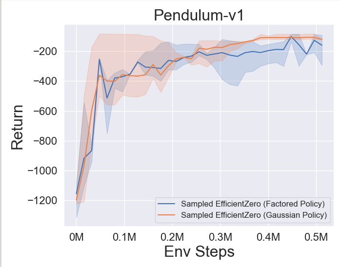
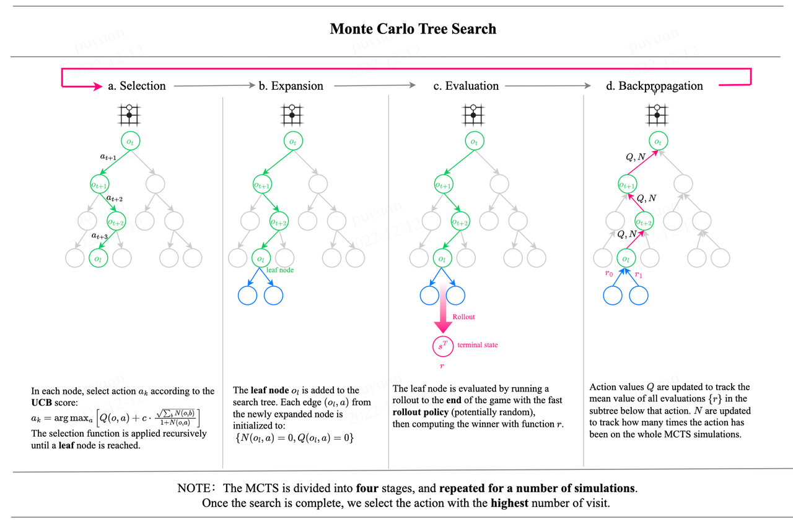
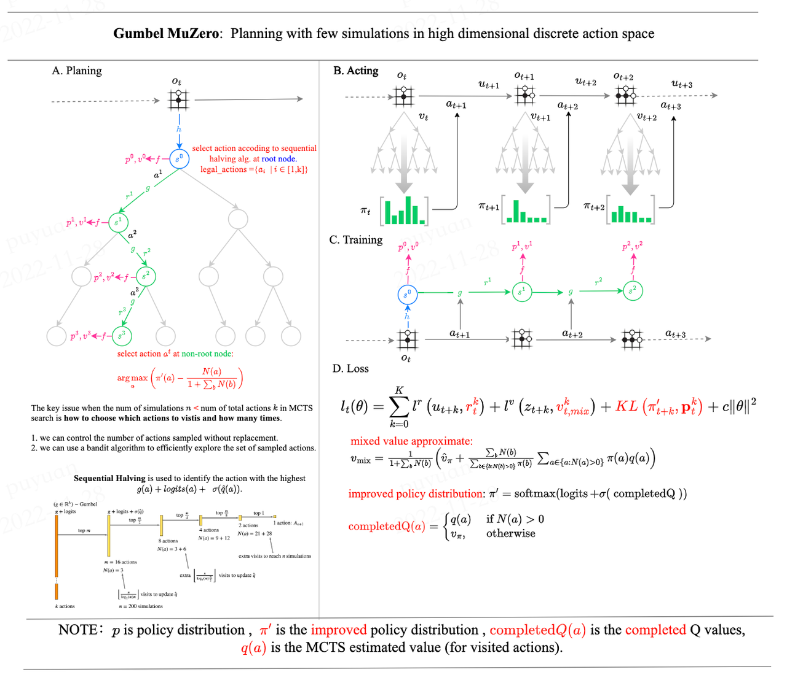

# LightZero

## 背景

下图为蒙特卡洛树搜索（MCTS）算法族的发展历史：


[English](https://github.com/opendilab/LightZero/blob/main/README.md) | 简体中文

## 概览
> LightZero 是一个轻量、高效、易懂的 MCTS+RL 开源算法库

### 导航
- [概览](#概览)
    - [导航](#导航)
    - [特点](#特点)
    - [框架结构](#框架结构)
    - [集成算法](#集成算法)
- [安装方法](#安装方法)
- [快速开始](#快速开始)
- [基线算法比较](#基线算法比较)
- [MCTS相关笔记](#MCTS-相关笔记)
    - [论文笔记](#论文笔记)
    - [算法框架图](#算法框架图)
- [MCTS相关论文](#MCTS-相关论文)
    - [重要论文](#重要论文)
    - [其他论文](#其他论文)
- [反馈意见和贡献](#反馈意见和贡献)
- [引用](#引用)
- [致谢](#致谢)
- [许可证](#许可证)

### 特点
**轻量**：LightZero 中集成了多种 MCTS 族算法，能够在同一框架下轻量化地解决多种属性的决策问题。

**高效**：LightZero 针对 MCTS 族算法中耗时最长的环节，采用混合异构计算编程提高计算效率。

**易懂**：LightZero 为所有集成的算法提供了详细文档和算法框架图，帮助用户理解算法内核，在同一范式下比较算法之间的异同。同时，LightZero 也为算法的代码实现提供了函数调用图和网络结构图，便于用户定位关键代码。

### 框架结构
为了理解 LightZero 的框架结构，需要了解的重要组件如下：

**Model**:
``Model`` 用于定义网络结构，包含``__init__``函数用于初始化网络结构，和``forward``函数用于计算网络的前向传播。

**Policy**:
``Policy`` 定义了对网络的更新方式和与环境交互的方式，包括三个过程，分别是训练过程（learn）、采样过程（collect）和评估过程（evaluate）。

**MCTS**:
``MCTS`` 定义了蒙特卡洛搜索树的结构和与``Policy``的交互方式。``MCTS``的实现包括 python 和 cpp 两种，分别在``ptree``和``ctree``中实现。

### 集成算法
LightZero 是基于 [PyTorch](https://pytorch.org/) 实现的 MCTS 算法库，在 MCTS 的实现中也用到了 cython 和 cpp。同时，LightZero 的框架主要基于 [DI-engine](https://github.com/opendilab/DI-engine) 实现。目前 LightZero 中集成的算法包括：
- [AlphaZero](https://www.science.org/doi/10.1126/science.aar6404)
- [MuZero](https://arxiv.org/abs/1911.08265)
- [EfficientZero](https://arxiv.org/abs/2111.00210)
- [Sampled MuZero](https://arxiv.org/abs/2104.06303)

## 安装方法

可以用以下命令从 Github 的源码中安装最新版的 LightZero：

```bash
git clone https://github.com/opendilab/LightZero.git
cd LightZero
pip3 install -e .
```


## 快速开始

使用如下代码在 [Pong](https://gymnasium.farama.org/environments/atari/pong/) 环境上快速训练一个 MuZero 智能体：

```bash
cd LightZero
python3 -u zoo/atari/config/atari_muzero_config.py
```

使用如下代码在 [TicTacToe](https://en.wikipedia.org/wiki/Tic-tac-toe) 环境上快速训练一个 MuZero 智能体：

```bash
cd LightZero
python3 -u zoo/board_games/tictactoe/config/tictactoe_muzero_bot-mode_config.py
```

## 基线算法比较

<details open><summary>点击折叠</summary>

以下是几种算法在 [Atari](https://github.com/opendilab/LightZero/blob/main/zoo/atari/envs/atari_lightzero_env.py) 上三个的离散动作空间环境上的基线比较结果，包括 [MuZero](https://github.com/opendilab/LightZero/blob/main/lzero/policy/muzero.py), [MuZero w/ SSL](https://github.com/opendilab/LightZero/blob/main/lzero/policy/muzero.py),[EfficientZero](https://github.com/opendilab/LightZero/blob/main/lzero/policy/efficientzero.py) 和 [Sampled EfficientZero](https://github.com/opendilab/LightZero/blob/main/lzero/policy/sampled_efficientzero.py)：

<p align="center">
  
  
  
  
</p>

以下是使用 ``Factored/Gaussian`` 策略表征方法的 [Sampled EfficientZero](https://github.com/opendilab/LightZero/blob/main/lzero/policy/sampled_efficientzero.py) 在两个连续动作空间上的基线效果：[Pendulum-v1](https://github.com/opendilab/LightZero/blob/main/zoo/classic_control/pendulum/envs/pendulum_lightzero_env.py) 和 [LunarLanderContinuous-v2](https://github.com/opendilab/LightZero/blob/main/zoo/box2d/lunarlander/envs/lunarlander_env.py)：

<p align="center">
  
  
  
</p>

以下是在两个棋类游戏（[TicTacToe(井字棋)](https://github.com/opendilab/LightZero/blob/main/zoo/board_games/tictactoe/envs/tictactoe_env.py) 和 [Gomoku(五子棋)](https://github.com/opendilab/LightZero/blob/main/zoo/board_games/gomoku/envs/gomoku_env.py)上 [AlphaZero](https://github.com/opendilab/LightZero/blob/main/lzero/policy/alphazero.py) 和 [MuZero](https://github.com/opendilab/LightZero/blob/main/lzero/policy/muzero.py) 的基线效果：

<p align="center">
  
  
</p>

</details>

## MCTS 相关笔记

### 论文笔记

以下是 LightZero 中集成算法的中文详细文档：

<details open><summary>点击折叠</summary>

[AlphaZero](https://github.com/opendilab/LightZero/blob/main/assets/paper_notes/AlphaZero.pdf)

[MuZero](https://github.com/opendilab/LightZero/blob/main/assets/paper_notes/MuZero.pdf)

[EfficientZero](https://github.com/opendilab/LightZero/blob/main/assets/paper_notes/EfficientZero.pdf)

[SampledMuZero](https://github.com/opendilab/LightZero/blob/main/assets/paper_notes/SampledMuZero.pdf)

[算法概览图符号表](https://github.com/opendilab/LightZero/blob/main/assets/paper_notes/SymbolTable.pdf)

</details>

### 算法框架图

以下是 LightZero 中集成算法的框架概览图：

<details closed>
<summary>(点击查看更多)</summary>






</details>

## MCTS 相关论文

以下是关于 **MCTS** 相关的论文集合，[这一部分](#MCTS-相关论文) 将会持续更新，追踪 MCTS 的前沿动态。

### 重要论文

<details closed>
<summary>(点击查看更多)</summary>

#### LightZero Implemented series

- [2018 _Science_ AlphaZero: A general reinforcement learning algorithm that masters chess, shogi, and Go through self-play](https://www.science.org/doi/10.1126/science.aar6404)
- [2019 MuZero: Mastering Atari, Go, Chess and Shogi by Planning with a Learned Model](https://arxiv.org/abs/1911.08265)
- [2021 EfficientZero: Mastering Atari Games with Limited Data](https://arxiv.org/abs/2111.00210)
- [2021 Sampled MuZero: Learning and Planning in Complex Action Spaces](https://arxiv.org/abs/2104.06303)

[comment]: <> (- [2022 Gumbel MuZero: Policy Improoveemenet by Planning with Gumbel]&#40;https://openreview.net/pdf?id=bERaNdoegnO&#41;)

#### AlphaGo series

- [2015 _Nature_ AlphaGo Mastering the game of Go with deep neural networks and tree search](https://www.nature.com/articles/nature16961)
- [2017 _Nature_ AlphaGo Zero Mastering the game of Go without human knowledge](https://www.nature.com/articles/nature24270)
- [2019 ELF OpenGo: An Analysis and Open Reimplementation of AlphaZero](https://arxiv.org/abs/1902.04522) 
  - [Code](https://github.com/pytorch/ELF)
#### MuZero series
- [2022 Online and Offline Reinforcement Learning by Planning with a Learned Model](https://arxiv.org/abs/2104.06294)
- [2021 Vector Quantized Models for Planning](https://arxiv.org/abs/2106.04615)
- [2022 Stochastic MuZero: Plannig in Stochastic Environments with A Learned Model](https://openreview.net/pdf?id=X6D9bAHhBQ1)
- [2021 Muesli: Combining Improvements in Policy Optimization. ](https://arxiv.org/abs/2104.06159)
#### MCTS Analysis
- [2020 Monte-Carlo Tree Search as Regularized Policy Optimization](https://arxiv.org/abs/2007.12509)
- [2021 Self-Consistent Models and Values](https://arxiv.org/abs/2110.12840)
- [2022 Adversarial Policies Beat Professional-Level Go AIs](https://arxiv.org/abs/2211.00241)
- [2022 _PNAS_ Acquisition of Chess Knowledge in AlphaZero.](https://arxiv.org/abs/2111.09259)

#### MCTS Application
- [2022 _Nature_ Discovering faster matrix multiplication algorithms with reinforcement learning](https://www.nature.com/articles/s41586-022-05172-4) 
  - [Code](https://github.com/deepmind/alphatensor)
- [2022 MuZero with Self-competition for Rate Control in VP9 Video Compression](https://arxiv.org/abs/2202.06626)
- [2021 DouZero: Mastering DouDizhu with Self-Play Deep Reinforcement Learning](https://arxiv.org/abs/2106.06135)
- [2019 Combining Planning and Deep Reinforcement Learning in Tactical Decision Making for Autonomous Driving](https://arxiv.org/pdf/1905.02680.pdf)

</details>

### 其他论文

<details closed>
<summary>(点击查看更多)</summary>

#### ICML
- [Efficient Learning for AlphaZero via Path Consistency](https://proceedings.mlr.press/v162/zhao22h/zhao22h.pdf) 2022
  - Dengwei Zhao, Shikui Tu, Lei Xu
  - Key: limited amount of self-plays,  path consistency (PC) optimality
  - ExpEnv: Go, Othello, Gomoku
- [Convex Regularization in Monte-Carlo Tree Search](https://arxiv.org/pdf/2007.00391.pdf) 2021
  - Tuan Dam, Carlo D'Eramo, Jan Peters, Joni Pajarinen
  - Key: entropy-regularization backup operators, regret analysis, Tsallis etropy, 
  - ExpEnv: synthetic tree, Atari
- [Information Particle Filter Tree: An Online Algorithm for POMDPs with Belief-Based Rewards on Continuous Domains](http://proceedings.mlr.press/v119/fischer20a/fischer20a.pdf) 2020
  - Johannes Fischer, Ömer Sahin Tas
  - Key: Continuous POMDP, Particle Filter Tree, information-based reward shaping, Information Gathering.
  - ExpEnv: POMDPs.jl framework
  - [Code](https://github.com/johannes-fischer/icml2020_ipft)
- [Retro*: Learning Retrosynthetic Planning with Neural Guided A* Search](http://proceedings.mlr.press/v119/chen20k/chen20k.pdf) 2020
  - Binghong Chen, Chengtao Li, Hanjun Dai, Le Song 
  - Key: chemical retrosynthetic planning, neural-based A*-like algorithm, ANDOR tree
  - ExpEnv: USPTO datasets
  - [Code](https://github.com/binghong-ml/retro_star)
#### ICLR
- [Enabling Arbitrary Translation Objectives with Adaptive Tree Search](https://arxiv.org/pdf/2202.11444.pdf) 2022
  - Wang Ling, Wojciech Stokowiec, Domenic Donato, Chris Dyer, Lei Yu, Laurent Sartran, Austin Matthews
  - Key: adaptive tree search, translation models, autoregressive models, 
  - ExpEnv: Chinese–English and Pashto–English tasks from WMT2020, German–English from WMT2014
- [What's Wrong with Deep Learning in Tree Search for Combinatorial Optimization](https://arxiv.org/abs/2201.10494) 2022
  - Maximili1an Böther, Otto Kißig, Martin Taraz, Sarel Cohen, Karen Seidel, Tobias Friedrich
  - Key: Combinatorial optimization, open-source benchmark suite for the NP-hard MAXIMUM INDEPENDENT SET problem, an in-depth analysis of the popular guided tree search algorithm,  compare the tree search implementations to other solvers
  - ExpEnv: NP-hard MAXIMUM INDEPENDENT SET.
  - [Code](https://github.com/maxiboether/mis-benchmark-framework)
- [Monte-Carlo Planning and Learning with Language Action Value Estimates](https://openreview.net/pdf?id=7_G8JySGecm) 2021
  - Youngsoo Jang, Seokin Seo, Jongmin Lee, Kee-Eung Kim
  - Key: Monte-Carlo tree search with language-driven exploration, locally optimistic language value estimates,
  - ExpEnv: Interactive Fiction (IF) games
- [Practical Massively Parallel Monte-Carlo Tree Search Applied to Molecular Design](https://arxiv.org/abs/2006.10504) 2021
  - Xiufeng Yang, Tanuj Kr Aasawat, Kazuki Yoshizoe
  - Key: massively parallel Monte-Carlo Tree Search, molecular design, Hash-driven parallel search, 
  - ExpEnv:  octanol-water partition coefficient (logP) penalized by the synthetic accessibility (SA) and large Ring Penalty score.
- [Watch the Unobserved: A Simple Approach to Parallelizing Monte Carlo Tree Search](https://arxiv.org/pdf/1810.11755.pdf) 2020
  - Anji Liu, Jianshu Chen, Mingze Yu, Yu Zhai, Xuewen Zhou, Ji Liu
  - Key: parallel Monte-Carlo Tree Search, partition the tree into sub-trees efficiently, compare the observation ratio of each processor
  - ExpEnv: speedup and performance comparison on JOY-CITY game, average episode return on atari game
  - [Code](https://github.com/liuanji/WU-UCT)
- [Learning to Plan in High Dimensions via Neural Exploration-Exploitation Trees](https://openreview.net/pdf?id=rJgJDAVKvB) 2020
  - Binghong Chen,  Bo Dai, Qinjie Lin, Guo Ye, Han Liu, Le Song
  - Key: meta path planning algorithm, exploits a novel neural architecture which can learn promising search directions from problem structures.
  - ExpEnv: a 2d workspace with a 2 DoF (degrees of freedom) point robot, a 3 DoF stick robot and a 5 DoF snake robot
#### NeurIPS
- [Evaluation Beyond Task Performance: Analyzing Concepts in AlphaZero in Hex](https://openreview.net/pdf?id=dwKwB2Cd-Km) 2022 
  - Charles Lovering, Jessica Zosa Forde, George Konidaris, Ellie Pavlick, Michael L. Littman
  - Key: AlphaZero’s internal representations, model probing and behavioral tests, how these concepts are captured in the network.
  - ExpEnv: Hex
- [Are AlphaZero-like Agents Robust to Adversarial Perturbations?](https://openreview.net/pdf?id=yZ_JlZaOCzv) 2022
  - Li-Cheng Lan, Huan Zhang, Ti-Rong Wu, Meng-Yu Tsai, I-Chen Wu, 4 Cho-Jui Hsieh
  - Key:  adversarial states, first adversarial attack on Go AIs
  - ExpEnv: Go
- [Monte Carlo Tree Descent for Black-Box Optimization](https://openreview.net/pdf?id=FzdmrTUyZ4g) 2022
  - Yaoguang Zhai, Sicun Gao
  - Key: Black-Box Optimization, how to further integrate samplebased descent for faster optimization. 
  - ExpEnv: synthetic functions for nonlinear optimization, reinforcement learning problems in MuJoCo locomotion environments, and optimization problems in Neural Architecture Search (NAS).
- [Monte Carlo Tree Search based Variable Selection for High Dimensional Bayesian Optimization](https://openreview.net/pdf?id=SUzPos_pUC) 2022
  - Lei Song∗ , Ke Xue∗ , Xiaobin Huang, Chao Qian
  - Key:  a low-dimensional subspace via MCTS, optimizes in the subspace with any Bayesian optimization algorithm.
  - ExpEnv: NAS-bench problems and MuJoCo locomotion
- [Monte Carlo Tree Search With Iteratively Refining State Abstractions](https://proceedings.neurips.cc/paper/2021/file/9b0ead00a217ea2c12e06a72eec4923f-Paper.pdf) 2021
  - Samuel Sokota, Caleb Ho, Zaheen Ahmad, J. Zico Kolter
  - Key: stochastic environments, Progressive widening, abstraction refining,
  - ExpEnv:  Blackjack, Trap, five by five Go.
- [Deep Synoptic Monte Carlo Planning in Reconnaissance Blind Chess](https://proceedings.neurips.cc/paper/2021/file/215a71a12769b056c3c32e7299f1c5ed-Paper.pdf) 2021
  - Gregory Clark
  - Key: imperfect information, belief state with an unweighted particle filter, a novel stochastic abstraction of information states.
  - ExpEnv:  reconnaissance blind chess
- [POLY-HOOT: Monte-Carlo Planning in Continuous Space MDPs with Non-Asymptotic Analysis](https://proceedings.neurips.cc/paper/2020/file/30de24287a6d8f07b37c716ad51623a7-Paper.pdf) 2020
  - Weichao Mao, Kaiqing Zhang, Qiaomin Xie, Tamer Ba¸sar
  - Key: continuous state-action spaces, Hierarchical Optimistic Optimization,
  - ExpEnv: CartPole, Inverted Pendulum, Swing-up, and LunarLander.
- [Learning Search Space Partition for Black-box Optimization using Monte Carlo Tree Search](https://proceedings.neurips.cc/paper/2020/file/e2ce14e81dba66dbff9cbc35ecfdb704-Paper.pdf) 2020
  - Linnan Wang, Rodrigo Fonseca, Yuandong Tian
  - Key: learns the partition of the search space using a few samples, a nonlinear decision boundary and learns a local model to pick good candidates.
  - ExpEnv: MuJoCo locomotion tasks, Small-scale Benchmarks, 
- [Mix and Match: An Optimistic Tree-Search Approach for Learning Models from Mixture Distributions](https://arxiv.org/abs/1907.10154) 2020
  - Matthew Faw, Rajat Sen, Karthikeyan Shanmugam, Constantine Caramanis, Sanjay Shakkottai
  - Key: covariate shift problem, Mix&Match combines stochastic gradient descent (SGD) with optimistic tree search and model re-use (evolving partially trained models with samples from different mixture distributions)
  - [Code](https://github.com/matthewfaw/mixnmatch)

#### Other Conference or Journal
- [On Monte Carlo Tree Search and Reinforcement Learning](https://www.jair.org/index.php/jair/article/download/11099/26289/20632) Journal of Artificial Intelligence Research 2017.
- [Sample-Efficient Neural Architecture Search by Learning Actions for Monte Carlo Tree Search](https://arxiv.org/pdf/1906.06832) IEEE Transactions on Pattern Analysis and Machine Intelligence 2022.
</details>

## 反馈意见和贡献
- 有任何疑问或意见都可以在 github 上直接 [提出 issue](https://github.com/opendilab/LightZero/issues/new/choose)
- 或者联系我们的邮箱 (opendilab@pjlab.org.cn)

- 感谢所有的反馈意见，包括对算法和系统设计。这些反馈意见和建议都会让 LightZero 变得更好。 


## 引用

```latex
@misc{lightzero,
    title={{LightZero: OpenDILab} A lightweight and efficient MCTS/AlphaZero/MuZero algorithm toolkits.},
    author={LightZero Contributors},
    publisher = {GitHub},
    howpublished = {\url{https://github.com/opendilab/LightZero}},
    year={2023},
}
```

## 致谢

本算法库的实现部分基于以下 github 库，非常感谢这些开创性工作：

- https://github.com/opendilab/DI-engine
- https://github.com/YeWR/EfficientZero
- https://github.com/werner-duvaud/muzero-general

特别感谢 [@PaParaZz1](https://github.com/PaParaZz1), [@karroyan](https://github.com/karroyan), [@nighood](https://github.com/nighood), 
[@jayyoung0802](https://github.com/jayyoung0802), [@timothijoe](https://github.com/timothijoe), [@TuTuHuss](https://github.com/TuTuHuss), [@puyuan1996](https://github.com/puyuan1996), [@HansBug](https://github.com/HansBug) 在本算法库中的贡献和支持。


## 许可证

本仓库中的所有代码都符合 [Apache License 2.0](https://www.apache.org/licenses/LICENSE-2.0)。