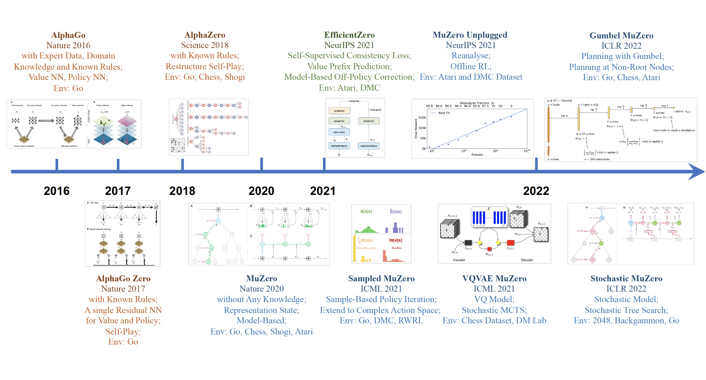

<div id="top"></div>

# LightZero

<div align="center">
    </a>
</div>

---

[](https://twitter.com/opendilab)
[](https://pypi.org/project/LightZero/)


[](https://github.com/opendilab/LightZero/actions?query=workflow%3A%22Code+Test%22)
[](https://github.com/opendilab/LightZero/actions?query=workflow%3A%22Badge+Creation%22)
[](https://github.com/opendilab/LightZero/actions?query=workflow%3A%22Package+Release%22)


[](https://github.com/opendilab/LightZero/stargazers)
[](https://github.com/opendilab/LightZero/network)

[](https://github.com/opendilab/LightZero/issues)
[](https://github.com/opendilab/LightZero/pulls)
[](https://github.com/opendilab/LightZero/graphs/contributors)
[](https://github.com/opendilab/LightZero/blob/master/LICENSE)

最近更新于 2024.02.08 LightZero-v0.0.4

> LightZero 是一个轻量、高效、易懂的 MCTS+RL 开源算法库。

[English](https://github.com/opendilab/LightZero/blob/main/README.md) | 简体中文 | [论文链接](https://arxiv.org/pdf/2310.08348.pdf)

## 背景

以 AlphaZero, MuZero 为代表的结合蒙特卡洛树搜索 (Monte Carlo Tree Search, MCTS) 和深度强化学习 (Deep Reinforcemeent Learning, DRL) 的方法，在诸如围棋，Atari 等各种游戏上取得了超人的水平，也在诸如蛋白质结构预测，矩阵乘法算法寻找等科学领域取得了可喜的进展。下图为蒙特卡洛树搜索（MCTS）算法族的发展历史：


## 概览

**LightZero** 是一个结合了蒙特卡洛树搜索和强化学习的开源算法工具包。 它支持一系列基于 MCTS 的 RL 算法，具有以下优点：
- 轻量。
- 高效。
- 易懂。

详情请参考[特点](#features)、[框架结构](#framework-structure)和[集成算法](#integrated-algorithms)。

**LightZero** 的目标是**标准化 MCTS 算法族，以加速相关研究和应用。** [Benchmark](#benchmark) 中介绍了目前所有已实现算法的性能比较。

### 导航
- [概览](#概览)
    - [导航](#导航)
    - [特点](#特点)
    - [框架结构](#框架结构)
    - [集成算法](#集成算法)
- [安装方法](#安装方法)
- [快速开始](#快速开始)
- [基线算法比较](#基线算法比较)
- [MCTS相关笔记](#MCTS-相关笔记)
    - [论文笔记](#论文笔记)
    - [算法框架图](#算法框架图)
- [MCTS相关论文](#MCTS-相关论文)
    - [重要论文](#重要论文)
    - [其他论文](#其他论文)
- [反馈意见和贡献](#反馈意见和贡献)
- [引用](#引用)
- [致谢](#致谢)
- [许可证](#许可证)

### 特点
**轻量**：LightZero 中集成了多种 MCTS 族算法，能够在同一框架下轻量化地解决多种属性的决策问题。

**高效**：LightZero 针对 MCTS 族算法中耗时最长的环节，采用混合异构计算编程提高计算效率。

**易懂**：LightZero 为所有集成的算法提供了详细文档和算法框架图，帮助用户理解算法内核，在同一范式下比较算法之间的异同。同时，LightZero 也为算法的代码实现提供了函数调用图和网络结构图，便于用户定位关键代码。

### 框架结构

<p align="center">
  
</p>

上图是 LightZero 的框架流程图。我们在下面简介其中的3个核心模块:

**Model**:
``Model`` 用于定义网络结构，包含``__init__``函数用于初始化网络结构，和``forward``函数用于计算网络的前向传播。

**Policy**:
``Policy`` 定义了对网络的更新方式和与环境交互的方式，包括三个过程，分别是训练过程（learn）、采样过程（collect）和评估过程（evaluate）。

**MCTS**:

``MCTS`` 定义了蒙特卡洛搜索树的结构和与``Policy``的交互方式。``MCTS``的实现包括 python 和 cpp 两种，分别在``ptree``和``ctree``中实现。

关于 LightZero 的文件结构，请参考 [lightzero_file_structure](https://github.com/opendilab/LightZero/blob/main/assets/lightzero_file_structure.svg)。

### 集成算法
LightZero 是基于 [PyTorch](https://pytorch.org/) 实现的 MCTS 算法库，在 MCTS 的实现中也用到了 cython 和 cpp。同时，LightZero 的框架主要基于 [DI-engine](https://github.com/opendilab/DI-engine) 实现。目前 LightZero 中集成的算法包括：
- [AlphaZero](https://www.science.org/doi/10.1126/science.aar6404)
- [MuZero](https://arxiv.org/abs/1911.08265)
- [Sampled MuZero](https://arxiv.org/abs/2104.06303)
- [Stochastic MuZero](https://openreview.net/pdf?id=X6D9bAHhBQ1)
- [EfficientZero](https://arxiv.org/abs/2111.00210)
- [Gumbel MuZero](https://openreview.net/pdf?id=bERaNdoegnO&)


LightZero 目前支持的环境及算法如下表所示：

| Env./Algo.    | AlphaZero | MuZero | EfficientZero | Sampled EfficientZero | Gumbel MuZero | Stochastic MuZero | 
|---------------| --------- | ------ |-------------| ------------------ | ---------- |----------------|
| TicTacToe     | ✔       | ✔      | 🔒           | 🔒                | ✔          | 🔒             |
| Gomoku        | ✔       | ✔      | 🔒          | 🔒               | ✔          | 🔒             |
| Connect4      | ✔       | ✔      | 🔒          | 🔒               | 🔒           | 🔒             |
| 2048          | ✔       | ✔      | 🔒            | 🔒                | 🔒           | ✔              |
| Chess         | 🔒       | 🔒     | 🔒          | 🔒               | 🔒         | 🔒             |
| Go            | 🔒       | 🔒     | 🔒          | 🔒               | 🔒         | 🔒             |
| CartPole      | ---       | ✔      | ✔           | ✔                | ✔          | ✔              |
| Pendulum      | ---       | ✔      | ✔           | ✔                | ✔          | ✔              |
| LunarLander   | ---       | ✔      | ✔           | ✔                | ✔          | ✔              |
| BipedalWalker | ---       | ✔      | ✔           | ✔                | ✔          | 🔒              |
| Atari         | ---       | ✔      | ✔           | ✔                | ✔          | ✔              |
| MuJoCo        | ---       | ✔     | ✔          | ✔                | 🔒         | 🔒               |
| MiniGrid      | ---       | ✔     | ✔          | ✔               | 🔒         | 🔒             |
| Bsuite        | ---       | ✔     | ✔          | ✔               | 🔒         | 🔒             |

<sup>(1): "✔" 表示对应的项目已经完成并经过良好的测试。</sup>

<sup>(2): "🔒" 表示对应的项目在等待列表中（正在进行中）。</sup>

<sup>(3): "---" 表示该算法不支持此环境。</sup>

## 安装方法

可以用以下命令从 Github 的源码中安装最新版的 LightZero：

```bash
git clone https://github.com/opendilab/LightZero.git
cd LightZero
pip3 install -e .
```

请注意，LightZero 目前仅支持在 `Linux` 和 `macOS` 平台上进行编译。
我们正在积极将该支持扩展到 `Windows` 平台。 

### 使用 Docker 进行安装

我们也提供了一个Dockerfile，用于设置包含运行 LightZero 库所需所有依赖项的环境。此 Docker 镜像基于 Ubuntu 20.04，并安装了Python 3.8以及其他必要的工具和库。
以下是如何使用我们的 Dockerfile 来构建 Docker 镜像，从该镜像运行一个容器，并在容器内执行 LightZero 代码的步骤。

1. **下载 Dockerfile**：Dockerfile 位于 LightZero 仓库的根目录中。将此[文件](https://github.com/opendilab/LightZero/blob/main/Dockerfile)下载到您的本地机器。

2. **准备构建上下文**：在您的本地机器上创建一个新的空目录，将 Dockerfile 移动到此目录，并导航到此目录。这一步有助于在构建过程中避免向 Docker 守护进程发送不必要的文件。
    ```bash
    mkdir lightzero-docker
    mv Dockerfile lightzero-docker/
    cd lightzero-docker/
    ```
3. **构建 Docker 镜像**：使用以下命令构建 Docker 镜像。此命令应在包含 Dockerfile 的目录内运行。
    ```bash
    docker build -t ubuntu-py38-lz:latest -f ./Dockerfile .
    ```
4. **从镜像运行容器**：使用以下命令以交互模式启动一个 Bash shell 的容器。
    ```bash
    docker run -dit --rm ubuntu-py38-lz:latest /bin/bash
    ```
5. **在容器内执行 LightZero 代码**：一旦你在容器内部，你可以使用以下命令运行示例 Python 脚本：
    ```bash
    python ./LightZero/zoo/classic_control/cartpole/config/cartpole_muzero_config.py
    ```

## 快速开始
使用如下代码在 [CartPole](https://gymnasium.farama.org/environments/classic_control/cart_pole/) 环境上快速训练一个 MuZero 智能体:

```bash
cd LightZero
python3 -u zoo/classic_control/cartpole/config/cartpole_muzero_config.py
```

使用如下代码在 [Pong](https://gymnasium.farama.org/environments/atari/pong/) 环境上快速训练一个 MuZero 智能体：

```bash
cd LightZero
python3 -u zoo/atari/config/atari_muzero_config.py
```

使用如下代码在 [TicTacToe](https://en.wikipedia.org/wiki/Tic-tac-toe) 环境上快速训练一个 MuZero 智能体：

```bash
cd LightZero
python3 -u zoo/board_games/tictactoe/config/tictactoe_muzero_bot_mode_config.py
```

## 基线算法比较

<details open><summary>点击折叠</summary>

- [AlphaZero](https://github.com/opendilab/LightZero/blob/main/lzero/policy/alphazero.py) 和 [MuZero](https://github.com/opendilab/LightZero/blob/main/lzero/policy/muzero.py) 在3个棋类游戏（[TicTacToe (井字棋)](https://github.com/opendilab/LightZero/blob/main/zoo/board_games/tictactoe/envs/tictactoe_env.py)，[Connect4](https://github.com/opendilab/LightZero/blob/main/zoo/board_games/connect4/envs/connect4_env.py) 和 [Gomoku (五子棋)](https://github.com/opendilab/LightZero/blob/main/zoo/board_games/gomoku/envs/gomoku_env.py)）上的基线结果：
<p align="center">
  
  
  
</p>

- [MuZero](https://github.com/opendilab/LightZero/blob/main/lzero/policy/muzero.py)，[MuZero w/ SSL](https://github.com/opendilab/LightZero/blob/main/lzero/policy/muzero.py)，[EfficientZero](https://github.com/opendilab/LightZero/blob/main/lzero/policy/efficientzero.py) 和 [Sampled EfficientZero](https://github.com/opendilab/LightZero/blob/main/lzero/policy/sampled_efficientzero.py) 在3个代表性的 [Atari](https://github.com/opendilab/LightZero/blob/main/zoo/atari/envs/atari_lightzero_env.py) 离散动作空间环境上的基线结果：
<p align="center">
  
  
  
  
</p>

- [Sampled EfficientZero](https://github.com/opendilab/LightZero/blob/main/lzero/policy/sampled_efficientzero.py)（包括 ``Factored/Gaussian`` 2种策略表征方法）在5个连续动作空间环境（[Pendulum-v1](https://github.com/opendilab/LightZero/blob/main/zoo/classic_control/pendulum/envs/pendulum_lightzero_env.py)，[LunarLanderContinuous-v2](https://github.com/opendilab/LightZero/blob/main/zoo/box2d/lunarlander/envs/lunarlander_env.py)，[BipedalWalker-v3](https://github.com/opendilab/LightZero/blob/main/zoo/box2d/bipedalwalker/envs/bipedalwalker_env.py)，[Hopper-v3](https://github.com/opendilab/LightZero/blob/main/zoo/mujoco/envs/mujoco_lightzero_env.py) 和 [Walker2d-v3](https://github.com/opendilab/LightZero/blob/main/zoo/mujoco/envs/mujoco_lightzero_env.py)）上的基线结果：
> 其中 ``Factored Policy`` 表示智能体学习一个输出离散分布的策略网络，上述5种环境手动离散化后的动作空间维度分别为11、49（7^2）、256（4^4)、64 (4^3) 和 4096 (4^6)。``Gaussian Policy``表示智能体学习一个策略网络，该网络直接输出高斯分布的参数 μ 和 σ。

<p align="center">
  
  
  
</p>
<p align="center">
  
  
  
</p>

- [Gumbel MuZero](https://github.com/opendilab/LightZero/blob/main/lzero/policy/gumbel_muzero.py) 和 [MuZero](https://github.com/opendilab/LightZero/blob/main/lzero/policy/muzero.py) 在不同模拟次数下，在四个环境（[PongNoFrameskip-v4](https://github.com/opendilab/LightZero/blob/main/zoo/atari/envs/atari_lightzero_env.py), [MsPacmanNoFrameskip-v4]((https://github.com/opendilab/LightZero/blob/main/zoo/atari/envs/atari_lightzero_env.py)), [Gomoku](https://github.com/opendilab/LightZero/blob/main/zoo/board_games/gomoku/envs/gomoku_env.py) 和 [LunarLanderContinuous-v2](https://github.com/opendilab/LightZero/blob/main/zoo/box2d/lunarlander/envs/lunarlander_env.py)）上的基线结果：
<p align="center">
  
  
  
  
</p>

- [Stochastic MuZero](https://github.com/opendilab/LightZero/blob/main/lzero/policy/stochastic_muzero.py) 和 [MuZero](https://github.com/opendilab/LightZero/blob/main/lzero/policy/muzero.py) 在具有不同随机性程度的[2048环境](https://github.com/opendilab/LightZero/blob/main/zoo/game_2048/envs/game_2048_env.py) (num_chances=2/5) 上的基线结果：
<p align="center">
  
  
</p>

- 结合不同的探索机制的 [MuZero w/ SSL](https://github.com/opendilab/LightZero/blob/main/lzero/policy/muzero.py) 在 [MiniGrid 环境](https://github.com/opendilab/LightZero/blob/main/zoo/minigrid/envs/minigrid_lightzero_env.py)上的基线结果：
<p align="center">
  
  
</p>

</details>

## MCTS 相关笔记

### 论文笔记

以下是 LightZero 中集成算法的中文详细文档：

<details open><summary>点击折叠</summary>

[AlphaZero](https://github.com/opendilab/LightZero/blob/main/assets/paper_notes/AlphaZero.pdf)

[MuZero](https://github.com/opendilab/LightZero/blob/main/assets/paper_notes/MuZero.pdf)

[EfficientZero](https://github.com/opendilab/LightZero/blob/main/assets/paper_notes/EfficientZero.pdf)

[SampledMuZero](https://github.com/opendilab/LightZero/blob/main/assets/paper_notes/SampledMuZero.pdf)

[GumbelMuZero](https://github.com/opendilab/LightZero/blob/main/assets/paper_notes/GumbelMuZero.pdf)

[StochasticMuZero](https://github.com/opendilab/LightZero/blob/main/assets/paper_notes/StochasticMuZero.pdf)

[算法概览图符号表](https://github.com/opendilab/LightZero/blob/main/assets/paper_notes/NotationTable.pdf)

</details>

### 算法框架图

以下是 LightZero 中集成算法的框架概览图：

<details closed>
<summary>(点击查看更多)</summary>

[MCTS](https://github.com/opendilab/LightZero/blob/main/assets/algo_overview/mcts_overview.pdf)

[AlphaZero](https://github.com/opendilab/LightZero/blob/main/assets/algo_overview/alphazero_overview.pdf)

[MuZero](https://github.com/opendilab/LightZero/blob/main/assets/algo_overview/muzero_overview.pdf)

[EfficientZero](https://github.com/opendilab/LightZero/blob/main/assets/algo_overview/efficientzero_overview.pdf)

[SampledMuZero](https://github.com/opendilab/LightZero/blob/main/assets/algo_overview/sampled_muzero_overview.pdf)

[GumbelMuZero](https://github.com/opendilab/LightZero/blob/main/assets/algo_overview/gumbel_muzero_overview.pdf)

</details>

## MCTS 相关论文

以下是关于 **MCTS** 相关的论文集合，[这一部分](#MCTS-相关论文) 将会持续更新，追踪 MCTS 的前沿动态。

### 重要论文

<details closed>
<summary>(点击查看更多)</summary>

#### LightZero Implemented series

- [2018 _Science_ AlphaZero: A general reinforcement learning algorithm that masters chess, shogi, and Go through self-play](https://www.science.org/doi/10.1126/science.aar6404)
- [2019 MuZero: Mastering Atari, Go, Chess and Shogi by Planning with a Learned Model](https://arxiv.org/abs/1911.08265)
- [2021 EfficientZero: Mastering Atari Games with Limited Data](https://arxiv.org/abs/2111.00210)
- [2021 Sampled MuZero: Learning and Planning in Complex Action Spaces](https://arxiv.org/abs/2104.06303)
- [2022 Stochastic MuZero: Plannig in Stochastic Environments with A Learned Model](https://openreview.net/pdf?id=X6D9bAHhBQ1)
- [2022 Gumbel MuZero: Policy Improvement by Planning with Gumbel](https://openreview.net/pdf?id=bERaNdoegnO&)


#### AlphaGo series

- [2015 _Nature_ AlphaGo Mastering the game of Go with deep neural networks and tree search](https://www.nature.com/articles/nature16961)
- [2017 _Nature_ AlphaGo Zero Mastering the game of Go without human knowledge](https://www.nature.com/articles/nature24270)
- [2019 ELF OpenGo: An Analysis and Open Reimplementation of AlphaZero](https://arxiv.org/abs/1902.04522) 
  - [Code](https://github.com/pytorch/ELF)
- [2023 Student of Games: A unified learning algorithm for both perfect and imperfect information games](https://www.science.org/doi/10.1126/sciadv.adg3256)

#### MuZero series
- [2022 Online and Offline Reinforcement Learning by Planning with a Learned Model](https://arxiv.org/abs/2104.06294)
- [2021 Vector Quantized Models for Planning](https://arxiv.org/abs/2106.04615)
- [2021 Muesli: Combining Improvements in Policy Optimization. ](https://arxiv.org/abs/2104.06159)

#### MCTS Analysis
- [2020 Monte-Carlo Tree Search as Regularized Policy Optimization](https://arxiv.org/abs/2007.12509)
- [2021 Self-Consistent Models and Values](https://arxiv.org/abs/2110.12840)
- [2022 Adversarial Policies Beat Professional-Level Go AIs](https://arxiv.org/abs/2211.00241)
- [2022 _PNAS_ Acquisition of Chess Knowledge in AlphaZero.](https://arxiv.org/abs/2111.09259)

#### MCTS Application
- [2023 Symbolic Physics Learner: Discovering governing equations via Monte Carlo tree search](https://openreview.net/pdf?id=ZTK3SefE8_Z)
- [2022 _Nature_ Discovering faster matrix multiplication algorithms with reinforcement learning](https://www.nature.com/articles/s41586-022-05172-4) 
  - [Code](https://github.com/deepmind/alphatensor)
- [2022 MuZero with Self-competition for Rate Control in VP9 Video Compression](https://arxiv.org/abs/2202.06626)
- [2021 DouZero: Mastering DouDizhu with Self-Play Deep Reinforcement Learning](https://arxiv.org/abs/2106.06135)
- [2019 Combining Planning and Deep Reinforcement Learning in Tactical Decision Making for Autonomous Driving](https://arxiv.org/pdf/1905.02680.pdf)

</details>

### 其他论文

<details closed>
<summary>(点击查看更多)</summary>

#### ICML
- [Scalable Safe Policy Improvement via Monte Carlo Tree Search](https://openreview.net/pdf?id=tevbBSzSfK) 2023
  - Alberto Castellini, Federico Bianchi, Edoardo Zorzi, Thiago D. Simão, Alessandro Farinelli, Matthijs T. J. Spaan
  - Key: safe policy improvement online using a MCTS based strategy, Safe Policy Improvement with Baseline Bootstrapping
  - ExpEnv: Gridworld and SysAdmin
- [Efficient Learning for AlphaZero via Path Consistency](https://proceedings.mlr.press/v162/zhao22h/zhao22h.pdf) 2022
  - Dengwei Zhao, Shikui Tu, Lei Xu
  - Key: limited amount of self-plays,  path consistency (PC) optimality
  - ExpEnv: Go, Othello, Gomoku
- [Visualizing MuZero Models](https://arxiv.org/abs/2102.12924) 2021
  - Joery A. de Vries, Ken S. Voskuil, Thomas M. Moerland, Aske Plaat
  - Key: visualizing the value equivalent dynamics model, action trajectories diverge, two regularization techniques
  - ExpEnv: CartPole and MountainCar.
and internal state transition dynamics,
- [Convex Regularization in Monte-Carlo Tree Search](https://arxiv.org/pdf/2007.00391.pdf) 2021
  - Tuan Dam, Carlo D'Eramo, Jan Peters, Joni Pajarinen
  - Key: entropy-regularization backup operators, regret analysis, Tsallis etropy, 
  - ExpEnv: synthetic tree, Atari
- [Information Particle Filter Tree: An Online Algorithm for POMDPs with Belief-Based Rewards on Continuous Domains](http://proceedings.mlr.press/v119/fischer20a/fischer20a.pdf) 2020
  - Johannes Fischer, Ömer Sahin Tas
  - Key: Continuous POMDP, Particle Filter Tree, information-based reward shaping, Information Gathering.
  - ExpEnv: POMDPs.jl framework
  - [Code](https://github.com/johannes-fischer/icml2020_ipft)
- [Retro*: Learning Retrosynthetic Planning with Neural Guided A* Search](http://proceedings.mlr.press/v119/chen20k/chen20k.pdf) 2020
  - Binghong Chen, Chengtao Li, Hanjun Dai, Le Song 
  - Key: chemical retrosynthetic planning, neural-based A*-like algorithm, ANDOR tree
  - ExpEnv: USPTO datasets
  - [Code](https://github.com/binghong-ml/retro_star)
#### ICLR
- [The Update Equivalence Framework for Decision-Time Planning](https://openreview.net/forum?id=JXGph215fL) 2024
  - Samuel Sokota, Gabriele Farina, David J Wu, Hengyuan Hu, Kevin A. Wang, J Zico Kolter, Noam Brown
  - Key: imperfect-information games, search, decision-time planning, update equivalence
  - ExpEnv: Hanabi, 3x3 Abrupt Dark Hex and Phantom Tic-Tac-Toe
- [Efficient Multi-agent Reinforcement Learning by Planning](https://openreview.net/forum?id=CpnKq3UJwp) 2024
  - Qihan Liu, Jianing Ye, Xiaoteng Ma, Jun Yang, Bin Liang, Chongjie Zhang
  - Key: multi-agent reinforcement learning, planning, multi-agent MCTS
  - ExpEnv: SMAC, LunarLander, MuJoCo, and Google Research Football
- [Become a Proficient Player with Limited Data through Watching Pure Videos](https://openreview.net/pdf?id=Sy-o2N0hF4f) 2023
  - Weirui Ye, Yunsheng Zhang, Pieter Abbeel, Yang Gao
  - Key: pre-training from action-free videos, forward-inverse cycle consistency (FICC) objective based on vector quantization, pre-training phase, fine-tuning phase.
  - ExpEnv: Atari
- [Policy-Based Self-Competition for Planning Problems](https://arxiv.org/abs/2306.04403) 2023
  - Jonathan Pirnay, Quirin Göttl, Jakob Burger, Dominik Gerhard Grimm
  - Key: self-competition, find strong trajectories by planning against possible strategies of its past self.
  - ExpEnv: Traveling Salesman Problem and the Job-Shop Scheduling Problem.
- [Explaining Temporal Graph Models through an Explorer-Navigator Framework](https://openreview.net/pdf?id=BR_ZhvcYbGJ) 2023
  - Wenwen Xia, Mincai Lai, Caihua Shan, Yao Zhang, Xinnan Dai, Xiang Li, Dongsheng Li
  - Key: Temporal GNN Explainer, an explorer to find the event subsets with MCTS, a navigator that learns the correlations between events and helps reduce the search space.
  - ExpEnv: Wikipedia and Reddit, Synthetic datasets
- [SpeedyZero: Mastering Atari with Limited Data and Time](https://openreview.net/pdf?id=Mg5CLXZgvLJ) 2023
  - Yixuan Mei, Jiaxuan Gao, Weirui Ye, Shaohuai Liu, Yang Gao, Yi Wu
  - Key: distributed RL system, Priority Refresh, Clipped LARS
  - ExpEnv: Atari
- [Efficient Offline Policy Optimization with a Learned Model](https://openreview.net/pdf?id=Yt-yM-JbYFO) 2023
  - Zichen Liu, Siyi Li, Wee Sun Lee, Shuicheng YAN, Zhongwen Xu
  - Key: Regularized One-Step Model-based algorithm for Offline-RL
  - ExpEnv: Atari，BSuite
  - [Code](https://github.com/sail-sg/rosmo/tree/main)
- [Enabling Arbitrary Translation Objectives with Adaptive Tree Search](https://arxiv.org/pdf/2202.11444.pdf) 2022
  - Wang Ling, Wojciech Stokowiec, Domenic Donato, Chris Dyer, Lei Yu, Laurent Sartran, Austin Matthews
  - Key: adaptive tree search, translation models, autoregressive models, 
  - ExpEnv: Chinese–English and Pashto–English tasks from WMT2020, German–English from WMT2014
- [What's Wrong with Deep Learning in Tree Search for Combinatorial Optimization](https://arxiv.org/abs/2201.10494) 2022
  - Maximili1an Böther, Otto Kißig, Martin Taraz, Sarel Cohen, Karen Seidel, Tobias Friedrich
  - Key: Combinatorial optimization, open-source benchmark suite for the NP-hard MAXIMUM INDEPENDENT SET problem, an in-depth analysis of the popular guided tree search algorithm,  compare the tree search implementations to other solvers
  - ExpEnv: NP-hard MAXIMUM INDEPENDENT SET.
  - [Code](https://github.com/maxiboether/mis-benchmark-framework)
- [Monte-Carlo Planning and Learning with Language Action Value Estimates](https://openreview.net/pdf?id=7_G8JySGecm) 2021
  - Youngsoo Jang, Seokin Seo, Jongmin Lee, Kee-Eung Kim
  - Key: Monte-Carlo tree search with language-driven exploration, locally optimistic language value estimates,
  - ExpEnv: Interactive Fiction (IF) games
- [Practical Massively Parallel Monte-Carlo Tree Search Applied to Molecular Design](https://arxiv.org/abs/2006.10504) 2021
  - Xiufeng Yang, Tanuj Kr Aasawat, Kazuki Yoshizoe
  - Key: massively parallel Monte-Carlo Tree Search, molecular design, Hash-driven parallel search, 
  - ExpEnv:  octanol-water partition coefficient (logP) penalized by the synthetic accessibility (SA) and large Ring Penalty score.
- [Watch the Unobserved: A Simple Approach to Parallelizing Monte Carlo Tree Search](https://arxiv.org/pdf/1810.11755.pdf) 2020
  - Anji Liu, Jianshu Chen, Mingze Yu, Yu Zhai, Xuewen Zhou, Ji Liu
  - Key: parallel Monte-Carlo Tree Search, partition the tree into sub-trees efficiently, compare the observation ratio of each processor
  - ExpEnv: speedup and performance comparison on JOY-CITY game, average episode return on atari game
  - [Code](https://github.com/liuanji/WU-UCT)
- [Learning to Plan in High Dimensions via Neural Exploration-Exploitation Trees](https://openreview.net/pdf?id=rJgJDAVKvB) 2020
  - Binghong Chen, Bo Dai, Qinjie Lin, Guo Ye, Han Liu, Le Song
  - Key: meta path planning algorithm, exploits a novel neural architecture which can learn promising search directions from problem structures.
  - ExpEnv: a 2d workspace with a 2 DoF (degrees of freedom) point robot, a 3 DoF stick robot and a 5 DoF snake robot
#### NeurIPS

- [LightZero: A Unified Benchmark for Monte Carlo Tree Search in General Sequential Decision Scenarios](https://openreview.net/pdf?id=oIUXpBnyjv) 2023
  - Yazhe Niu, Yuan Pu, Zhenjie Yang, Xueyan Li, Tong Zhou, Jiyuan Ren, Shuai Hu, Hongsheng Li, Yu Liu
  - Key: the first unified benchmark for deploying MCTS/MuZero in general sequential decision scenarios.
  - ExpEnv: ClassicControl, Box2D, Atari, MuJoCo, GoBigger, MiniGrid, TicTacToe, ConnectFour, Gomoku, 2048, etc.
- [Large Language Models as Commonsense Knowledge for Large-Scale Task Planning](https://openreview.net/pdf?id=Wjp1AYB8lH) 2023
  - Zirui Zhao, Wee Sun Lee, David Hsu
  - Key: world model (LLM) and the LLM-induced policy can be combined in MCTS, to scale up task planning.
  - ExpEnv: multiplication, travel planning, object rearrangement
- [Monte Carlo Tree Search with Boltzmann Exploration](https://openreview.net/pdf?id=NG4DaApavi) 2023
  - Michael Painter, Mohamed Baioumy, Nick Hawes, Bruno Lacerda
  - Key: Boltzmann exploration with MCTS, optimal actions for the maximum entropy objective do not necessarily correspond to optimal actions for the original objective, two improved algorithms.
  - ExpEnv: the Frozen Lake environment, the Sailing Problem, Go
- [Generalized Weighted Path Consistency for Mastering Atari Games](https://openreview.net/pdf?id=vHRLS8HhK1) 2023
  - Dengwei Zhao, Shikui Tu, Lei Xu
  - Key: Generalized Weighted Path Consistency, A weighting mechanism.
  - ExpEnv: Atari
- [Accelerating Monte Carlo Tree Search with Probability Tree State Abstraction](https://openreview.net/pdf?id=0zeLTZAqaJ) 2023
  - Yangqing Fu, Ming Sun, Buqing Nie, Yue Gao
  - Key: probability tree state abstraction, transitivity and aggregation error bound
  - ExpEnv: Atari, CartPole, LunarLander, Gomoku
- [Planning for Sample Efficient Imitation Learning](https://openreview.net/forum?id=BkN5UoAqF7) 2022
  - Zhao-Heng Yin, Weirui Ye, Qifeng Chen, Yang Gao
  - Key: Behavioral Cloning，Adversarial Imitation Learning (AIL)，MCTS-based RL，
  - ExpEnv: DeepMind Control Suite
  - [Code](https://github.com/zhaohengyin/EfficientImitate)
- [Evaluation Beyond Task Performance: Analyzing Concepts in AlphaZero in Hex](https://openreview.net/pdf?id=dwKwB2Cd-Km) 2022 
  - Charles Lovering, Jessica Zosa Forde, George Konidaris, Ellie Pavlick, Michael L. Littman
  - Key: AlphaZero’s internal representations, model probing and behavioral tests, how these concepts are captured in the network.
  - ExpEnv: Hex
- [Are AlphaZero-like Agents Robust to Adversarial Perturbations?](https://openreview.net/pdf?id=yZ_JlZaOCzv) 2022
  - Li-Cheng Lan, Huan Zhang, Ti-Rong Wu, Meng-Yu Tsai, I-Chen Wu, 4 Cho-Jui Hsieh
  - Key:  adversarial states, first adversarial attack on Go AIs
  - ExpEnv: Go
- [Monte Carlo Tree Descent for Black-Box Optimization](https://openreview.net/pdf?id=FzdmrTUyZ4g) 2022
  - Yaoguang Zhai, Sicun Gao
  - Key: Black-Box Optimization, how to further integrate samplebased descent for faster optimization. 
  - ExpEnv: synthetic functions for nonlinear optimization, reinforcement learning problems in MuJoCo locomotion environments, and optimization problems in Neural Architecture Search (NAS).
- [Monte Carlo Tree Search based Variable Selection for High Dimensional Bayesian Optimization](https://openreview.net/pdf?id=SUzPos_pUC) 2022
  - Lei Song∗ , Ke Xue∗ , Xiaobin Huang, Chao Qian
  - Key:  a low-dimensional subspace via MCTS, optimizes in the subspace with any Bayesian optimization algorithm.
  - ExpEnv: NAS-bench problems and MuJoCo locomotion
- [Monte Carlo Tree Search With Iteratively Refining State Abstractions](https://proceedings.neurips.cc/paper/2021/file/9b0ead00a217ea2c12e06a72eec4923f-Paper.pdf) 2021
  - Samuel Sokota, Caleb Ho, Zaheen Ahmad, J. Zico Kolter
  - Key: stochastic environments, Progressive widening, abstraction refining,
  - ExpEnv:  Blackjack, Trap, five by five Go.
- [Deep Synoptic Monte Carlo Planning in Reconnaissance Blind Chess](https://proceedings.neurips.cc/paper/2021/file/215a71a12769b056c3c32e7299f1c5ed-Paper.pdf) 2021
  - Gregory Clark
  - Key: imperfect information, belief state with an unweighted particle filter, a novel stochastic abstraction of information states.
  - ExpEnv:  reconnaissance blind chess
- [POLY-HOOT: Monte-Carlo Planning in Continuous Space MDPs with Non-Asymptotic Analysis](https://proceedings.neurips.cc/paper/2020/file/30de24287a6d8f07b37c716ad51623a7-Paper.pdf) 2020
  - Weichao Mao, Kaiqing Zhang, Qiaomin Xie, Tamer Ba¸sar
  - Key: continuous state-action spaces, Hierarchical Optimistic Optimization,
  - ExpEnv: CartPole, Inverted Pendulum, Swing-up, and LunarLander.
- [Learning Search Space Partition for Black-box Optimization using Monte Carlo Tree Search](https://proceedings.neurips.cc/paper/2020/file/e2ce14e81dba66dbff9cbc35ecfdb704-Paper.pdf) 2020
  - Linnan Wang, Rodrigo Fonseca, Yuandong Tian
  - Key: learns the partition of the search space using a few samples, a nonlinear decision boundary and learns a local model to pick good candidates.
  - ExpEnv: MuJoCo locomotion tasks, Small-scale Benchmarks, 
- [Mix and Match: An Optimistic Tree-Search Approach for Learning Models from Mixture Distributions](https://arxiv.org/abs/1907.10154) 2020
  - Matthew Faw, Rajat Sen, Karthikeyan Shanmugam, Constantine Caramanis, Sanjay Shakkottai
  - Key: covariate shift problem, Mix&Match combines stochastic gradient descent (SGD) with optimistic tree search and model re-use (evolving partially trained models with samples from different mixture distributions)
  - [Code](https://github.com/matthewfaw/mixnmatch)

#### Other Conference or Journal
- [On Monte Carlo Tree Search and Reinforcement Learning](https://www.jair.org/index.php/jair/article/download/11099/26289/20632) Journal of Artificial Intelligence Research 2017.
- [Sample-Efficient Neural Architecture Search by Learning Actions for Monte Carlo Tree Search](https://arxiv.org/pdf/1906.06832) IEEE Transactions on Pattern Analysis and Machine Intelligence 2022.
</details>

## 反馈意见和贡献
- 有任何疑问或意见都可以在 github 上直接 [提出 issue](https://github.com/opendilab/LightZero/issues/new/choose)
- 或者联系我们的邮箱 (opendilab@pjlab.org.cn)

- 感谢所有的反馈意见，包括对算法和系统设计。这些反馈意见和建议都会让 LightZero 变得更好。 


## 引用

```latex
@misc{lightzero,
      title={LightZero: A Unified Benchmark for Monte Carlo Tree Search in General Sequential Decision Scenarios},
      author={Yazhe Niu and Yuan Pu and Zhenjie Yang and Xueyan Li and Tong Zhou and Jiyuan Ren and Shuai Hu and Hongsheng Li and Yu Liu},
      year={2023},
      eprint={2310.08348},
      archivePrefix={arXiv},
      primaryClass={cs.LG}
}
```

## 致谢
此算法库的实现部分基于以下 GitHub 仓库，非常感谢这些开创性工作：
- https://github.com/opendilab/DI-engine
- https://github.com/deepmind/mctx
- https://github.com/YeWR/EfficientZero
- https://github.com/werner-duvaud/muzero-general

特别感谢以下贡献者 [@PaParaZz1](https://github.com/PaParaZz1), [@karroyan](https://github.com/karroyan), [@nighood](https://github.com/nighood), 
[@jayyoung0802](https://github.com/jayyoung0802), [@timothijoe](https://github.com/timothijoe), [@TuTuHuss](https://github.com/TuTuHuss), [@HarryXuancy](https://github.com/HarryXuancy), [@puyuan1996](https://github.com/puyuan1996), [@HansBug](https://github.com/HansBug) 对本项目的贡献和支持。

感谢所有为此项目做出贡献的人：
<a href="https://github.com/opendilab/LightZero/graphs/contributors">

</a>

## 许可证

本仓库中的所有代码都符合 [Apache License 2.0](https://www.apache.org/licenses/LICENSE-2.0)。

<p align="right">(<a href="#top">回到顶部</a>)</p>

