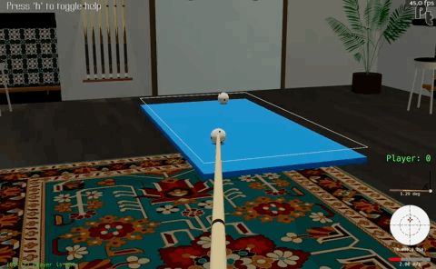
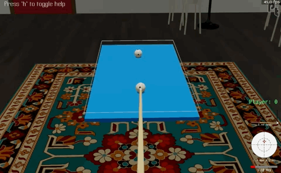
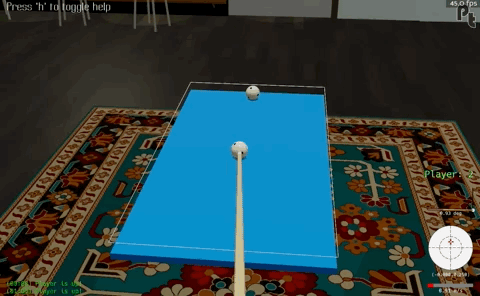
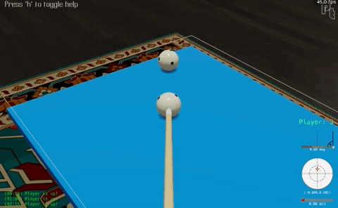

# Billiards RL

Welcome to the documentation for billiards simulation within the LightZero framework. jBilliards offers an intriguing learning environment for reinforcement learning due to its continuous action space, turn-based play, and the need for long-term planning and strategy formulation.

## Pooltool

Pooltool is a general purpose billiards simulator crafted specifically for science and engineering applications (learn more [here](https://github.com/ekiefl/pooltool)). It has been incorporated into LightZero to create diverse learning environments for billiards games.

## Testing your installation

Pooltool comes pre-installed with LightZero. If you are using a custom setup, follow the _pip_ install instructions [here](https://pooltool.readthedocs.io/en/latest/getting_started/install.html#install-option-1-pip).

Verify pooltool is found in your python path:

```bash
python -c "import pooltool; print(pooltool.__version__)"
```

Further test your installation by opening the interactive interface:

```bash
# Unix
run_pooltool

# Windows
run_pooltool.bat
```

(For instructions on how to play, check out the [Getting Started tutorial](https://pooltool.readthedocs.io/en/latest/getting_started/interface.html))

## Supported Games

Currently supports the following games:

1. **Sum to Three**: A simplified billiards game designed to make learning easier for agents.
2. **Standard Billiards Games** (planned for future updates): Including 8-ball, 9-ball, and snooker.

The rest of the document provides details for each supported game.

## Game 1: Sum to Three

Standard billiards games like 8-ball, 9-ball, and snooker have complex rulesets which make learning more difficult.

In contrast, _sum to three_ is a fictitious billiards game with a simple ruleset.

### Rules

1. The game is played on a table with no pockets
1. There are 2 balls: a cue ball and an object ball
1. The player must hit the object ball with the cue ball
1. The player scores a point if the number of times a ball hits a cushion is 3
1. The player takes 10 shots, and their final score is the number of points they achieve

For example, this is a successful shot because there are three ball-cushion collisions:



This is an unsuccessful shot because there are four ball-cushion collisions:



### Observation / Action Spaces

Continuous and discrete observatwon spaces are supported. The continuous observation space uses the coordinates of the two balls as the observation. The discrete observation space is based on configurable image-based feature planes.

In general, when an agent strikes a cue ball, the cue stick is described by 5 continuous parameters:

```
V0 : positive float
    What initial velocity does the cue strike the ball?
phi : float (degrees)
    The direction you strike the ball
theta : float (degrees)
    How elevated is the cue from the playing surface, in degrees?
a : float
    How much side english should be put on? -1 being rightmost side of ball, +1 being
    leftmost side of ball
b : float
    How much vertical english should be put on? -1 being bottom-most side of ball, +1 being
    topmost side of ball
```

Since sum to three is a simple game, only a reduced action space with 2 parameters is supported:

1. V0: The speed of the cue stick. Increasing this means the cue ball travels further
1. cut angle: The angle that the cue ball hits the object ball with

For example, in this shot, the cut angle is -70 (hitting the left side of the object ball):



For example, in this shot, the cut angle is 0 (head-on collision):



Based on the game dimensions, a suitable bound for the action parameters is used: [0.3, 3] for speed and [-70, 70] for cut angle.

### Experiments

You can conduct experiments using different observation spaces:

1. **Continuous Observation Space Experiment**:
    - Run the experiment with:
      ```bash
      python ./zoo/pooltool/sum_to_three/config/sum_to_three_config.py
      ```
    - Results will be saved in `./data_pooltool_ctree/`.

2. **Discrete Observation Space Experiment**:
    - Run the experiment with:
      ```bash
      python ./zoo/pooltool/sum_to_three/config/sum_to_three_image_config.py
      ```
    - Modify the feature plane information by editing `./zoo/pooltool/sum_to_three/config/feature_plane_config.json`. View the usage example in `./zoo/pooltool/image_representation.py` for details about the feature plane content.
    - Results will be saved in `./data_pooltool_ctree/`.

### Results

TODO(puyuan1996)

## Game 2: 8-ball / 9-ball / 3-cushion / snooker

What billiards game would you like to see next?
