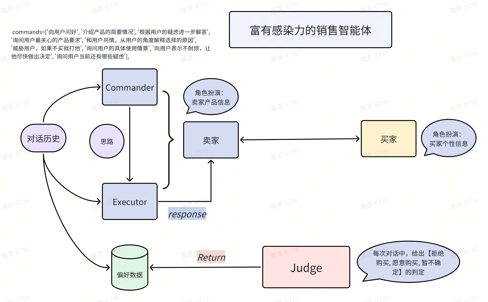

# Seller

## 概述

Seller 环境的目标是模拟一个推销的场景，使用语言模型扮演不同的交互角色，进行多轮对话。最终环境胜利的标准是语言模型所扮演的卖家，能将指定的产品推销给对应用户。具体而言，该环境分为三个主要角色，他们之间的互动关系如下图所示：



- 买家（Buyer）：在环境初始时，会随机给买家设定一个角色人设。买家会根据卖家对其推销的话术，结合自身的角色人设，使用语言模型对是否购买、是否存在疑虑进行多轮的回复。
- 卖家（Seller）：给定产品信息，以及推销的思路，使用语言模型生成多轮的推销话术。
- 评判者（Judge）：根据卖家和买家历史的多轮对话信息，利用语言模型判定推销是否成功。

在环境开始后，在每一个环境的 transition 中，包括如下几个步骤：1）智能体向卖家提供推销思路（即环境收到的动作）；2）卖家模型根据思路给出具体的推销话术；3）买家模型根据新的话术，以及自身的角色设定需求，给出反馈；4）评判者根据对话的历史信息评价推销是否成功，如果成功则结束环境返回+1的奖励；如果不成功检查当前对话轮次，没有超过轮次上限则进入下一轮对话，否则直接判定为失败，返回-1的奖励。

## 安装

### 安装方法

为了安装本环境，您只需要安装最新版的 DI-engine，以及使用语言模型 api 时需要调用的 openai 库即可。

```shell
pip3 install DI-engine openai
```

### 部署语言模型

为了能够运行该环境，和语言模型智能体进行交互，你需要部署语言模型。目前该环境支持使用 api 进行调用，以及使用 `lmdeploy` 本地部署两种方案。接下来是对这两种方案的分别介绍：

#### 调用 api

本环境支持对主流的语言模型 api 进行直接调用反馈的模式。以 deepseek api 为例。具体的操作步骤如下所示：

- 首先在 deepseek 官网上进行注册：[DeepSeek 开放平台](https://platform.deepseek.com/sign_in)
- 然后在官方入口进行充值，并生成 api-key：[DeepSeek 开放平台](https://platform.deepseek.com/api_keys)
- 更具体的使用信息请查阅官网的文档：[常见问题 | DeepSeek API Docs](https://api-docs.deepseek.com/zh-cn/faq/)

#### 本地部署

除了支持 api 的调用之外，该环境还支持使用 `lmdeploy` 来本地部署语言模型进行对话。

具体的操作步骤请参考 `lmdeply` 的官方项目地址为：[lmdeploy](https://github.com/InternLM/lmdeploy)，以及相应的文档链接：[Quick Start — lmdeploy](https://lmdeploy.readthedocs.io/en/latest/get_started/get_started.html)。

### 验证安装

在完成上述操作之后，您首先需要在当前文件夹下的 ``seller_env.py`` 中填写希望使用语言模型的配置。主要包括两个字段：

- agent：代表使用语言模型的类型。目前支持的类型包括：deepseek，gpt3.5，gpt4，lmdeploy（即自己部署本地语言模型）
- api-key：对应语言模型可用的 api-key 列表。

在配置成功后，直接执行下列命令即可和环境开启交互：

```shell
python3 seller_env.py
```

## 环境的空间设定

### 观察空间

环境的观察空间是一个Python字典，包含以下几个部分：

- `observation`：这是一个记录所有历史对话信息的列表，每个列表元素中包含了一个字典，包括了说话人的角色（role），当前对话轮次（round）、对话内容（content）。
- `action_mask`：可使用的动作掩码。在默认情况下，所有在 commands 中的动作均是合法的，因此掩码是一个长度和 commands 相同的全 1 向量。
- `round_cnt`：当前对话已进行的轮次数量。
- `eval_episode_return`：当前环境执行已经累积获得的 reward 值。
- `seed_for_goods`：卖家需要推销物品的随机种子。不同的 seed 会导致推销的物品不同。
- `seed_for_persona`：买家人物设定的随机种子，不同 seed 会导致买家的人物设定不同。

### 动作空间

环境的动作空间是一个标准的离散动作空间，其可选的具体动作和观察空间中的 `action_mask` 保持一致。

### 奖励空间

环境的奖励函数是一个取值在 {-1，0，+1} 中的值。具体的判断条件如下：

- 奖励为0的情况：交互轮次没有超过轮次上限，并且评判者认为买家既没有表现出明显的购买倾向，也没有明显的拒绝倾向。
- 奖励为-1的情况：交互轮次超过轮次上限；或评判者认为买家表现出了明显的拒绝倾向。
- 奖励为+1的情况：评判者认为买家表现出来明显的购买倾向。

### 其它

- 环境的终止时机：当环境收到第一个非0的奖励值时，此时意味着推销的对话已经结束，环境也就终止了。
- 环境的随机性设置：不同的 `seed` 值会影响买家语言模型的背景人格设定，以及卖家模型需要推销的产品信息。但是请注意，由于语言模型 api 的随机性不能完全保证，因此即便对应相同的问题，模型也可能做出不同的回答。如果需要对语言模型生成的随机性进行规范，请调整对应的生成参数。

## FAQ

- 如何修改对语言模型各种角色的 prompt？

  答：可以修改 `./prompt_templates` 中的 txt 文件，每个文件对应了不同角色的 prompt 模板。修改过后，环境中对应角色的相应行为也会随之发生改变。

- 如何添加其它来源的 api？

  答：当前我们支持 deepseek 和 openai 的 api-key。如果需要使用其它的 api，请在 ``utils.py`` 中的 `APIClient` 模块中添加。

## TODO
- Agent 上层 LM （Commander）动作空间是很⼤的
  - 预定义动作空间：如果固定相当于⼈为设置了性能上限
  - 如果不固定，如何处理变化的动作空间: action_mask

- Users 模型拟⼈的真实性
  - 提⽰词优化

- Judge 模型的准确性
  - Judge 给出的 reward 信息决定着优化的⽅向
  - 可以先通过偏好数据 SFT LM 得到

- 多轮对话之间的连贯性

    - ⽬前没有强制约束来优化连贯性

    - 可以使⽤代理指标


- meta-atcion 的粒度
    - ⼀个 meta-atcion 不⼀定对应⼀轮
